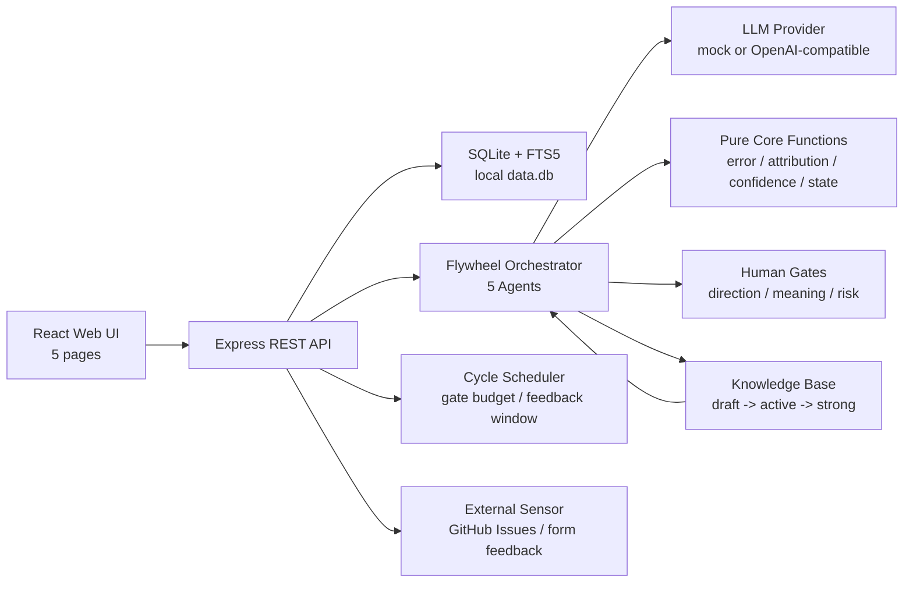

> ⚠️ 迭代前必读：[PRINCIPLES.md](./PRINCIPLES.md) — 违反 Part 1 任何一条等于项目根基塌掉。

# Alaya — 认知复利飞轮系统

Alaya 是一个本地优先的「认知复利」MVP：每一轮产品/运营动作都会留下预测、观察、误差归因和知识沉淀；下一轮决策必须显式引用这些知识，并被人工闸门约束在安全边界内。

当前仓库实现的是从 Phase 1 向「真实 LLM + 自动化运转 + 人工闸门」推进后的本地 MVP：

- `alaya-core`: TypeScript 纯内核，验证飞轮机制是否成立。
- `alaya-app`: Express + React + SQLite Web MVP，把内核接上数据库、Onboarding、Scheduler、Human Gates 和外部反馈入口。
- LLM 默认使用 deterministic mock；设置 `ALAYA_LLM_PROVIDER=openai` 和本机 `OPENAI_*` / key file 后可切到真实 OpenAI-compatible provider。
- SQLite 数据库本地生成，`data.db*` 不提交到仓库。

## 本次升级提交说明

这版代码把 Phase 1 mock MVP 沿 PRD 的 Phase 2 -> 4 路线推进到「真实 LLM + 自动化运转 + 人工闸门 + 外部 Sensor」的可审计本地系统。主要迭代如下：

1. **治理约束落地**：新增 `PRINCIPLES.md`、`scripts/check-principles.mjs`、GitHub Actions 和 pre-commit 接线，机检纯函数无副作用、人类闸门、灰区弱累加、脏知识隔离、LLM SDK 边界和数据库审计写路径；补齐「底线 3 - 审计旁路」检查，禁止业务代码绕过 `storage.ts` 裸写数据库。
2. **真实 LLM Provider**：`alaya-core/src/llm/provider.ts` 和 `alaya-app/server/llm.ts` 支持 OpenAI-compatible / MiniMax endpoint；每次 Agent 调用携带 `promptVersion`、结构化上下文、JSON Schema、知识摘要、draft output 和禁止事项；输出按 retry、具体 schema diagnostics、simplified schema、原 schema 回升校验、non-blocking human gate 降级，并记录 latency/token/cost。
3. **Secret 安全与 live readiness**：新增 `npm run setup:secrets` 隐藏输入，本地写 `/private/tmp/alaya-minimax-key` 与 `/private/tmp/alaya-github-token`，权限 `0600`；所有 live 子命令支持默认 key file、空 env fallback、宽权限失败关闭和 secret 扫描。
4. **Onboarding / Project Setup**：新增 New Project 和 Project Setup 页面；Onboarding Interview 覆盖 PRD 13.1 的核心维度，并把 `seedIdentity`、`worldModel`、redlines、预算和第一轮 claim 配置写入数据库；Project Setup 的人工修改会同步 seed knowledge items。
5. **自动 Scheduler 与 Gate Budget**：新增后台 scheduler，可自动开方向闸、等待 blocking gate、同步反馈窗口、关闭 cycle 并创建下一轮方向闸；支持 meaning gate 合并、重复高批准率自动通过 + 抽样复核、人类注意力过载、Builder 超时降级、LLM 成本预算闸。
6. **真实外部 Sensor**：新增 GitHub Issues 和表单反馈 source；Sensor 做 PII 脱敏、LLM 分类、来源元数据落库、模糊信号进入 non-blocking meaning gate；GitHub 同步失败会创建 blocking 风险闸，避免把 API 中断误判为真实无反馈。
7. **第 4 轮复利资产**：飞轮从 3 轮扩展为显式 4 轮，并禁止 `>=4` 复用第 3 轮模板；第 4 轮产出 rollback-ready change package、audit summary 和 `createdByCycle=4` 的 principle。
8. **PRD 22.5 失败阈值**：实现并测试 LLM 成本超预算、pending_human 过载、每周人工时间超 5 小时、blocking gate 超 3 条、blocking gate 超 5 天、飞轮空转、预测不可测、知识成熟停滞、Librarian stale/conflict 审计失败、Builder 偏航、外部反馈同步失败等停机路径。
9. **端到端验收脚本**：新增真实 LLM preflight、真实 LLM 4 轮飞轮、UI onboarding、后台 scheduler、真实 GitHub Issue Sensor、GitHub autonomous Sensor 和一键 live runner。
10. **宪法守卫自测加固**：修复底线 3 审计旁路检查的非确定性误报风险，新增元测试覆盖正则状态污染、方法体花括号解析、cwd 无关探测、纯函数违规注入和 `createKnowledge()` 审计缺失反向验证。

当前事实状态：

- `npm run audit:upgrade` 在本机 key file 存在时为 `complete:true`，表示结构和 live 前置齐备。
- mock / 本地非 live 流程已通过测试与 E2E。
- 真实 MiniMax provider preflight 已通过 schema-valid JSON 验证，真实 MiniMax 4 轮飞轮已跑通 20 次 Agent 调用并通过 PRD 17.3 + 第 4 轮 rollback/audit 验收。
- 完整 `npm run e2e:live` 已通过：真实 LLM preflight、真实 LLM 4 轮飞轮、UI onboarding、后台 scheduler、真实 GitHub autonomous Sensor E2E 和最终 `audit:upgrade` 均完成。

## 项目状态

| 模块 | 状态 | 说明 |
| --- | --- | --- |
| `alaya-core` | 可运行 | 44 个单元测试覆盖误差计算、归因、置信度、知识状态机、LLM key file、timeout、LLM 输出消费、MiniMax thinking-block 解析、schema 回升和 4 轮飞轮 |
| `alaya-app` | 可运行 | 33 个集成测试覆盖 Dashboard、Human Gates、Prediction Ledger、Knowledge Base、Cycle Review、New Project、Project Setup、Scheduler、Sensor、MiniMax thinking-block 解析和 schema 回升 |
| `scripts` | 可运行 | 13 个脚本测试覆盖 GitHub target 推断、本地 secret readiness、权限失败关闭、live runner 前置保护和宪法守卫元测试 |
| 数据库 | 本地 SQLite | 首次启动自动 seed 一键发布演示项目 |
| 搜索 | FTS5 | 知识库支持中文全文检索 |
| LLM | mock / OpenAI-compatible | 结构化 JSON schema、具体 schema diagnostics、retry、简化 schema、原 schema 回升、MiniMax thinking-block 解析、降级 human gate、请求 timeout、调用日志和成本统计 |
| Scheduler | 可运行 | 自动开方向闸、等待 blocking gate、同步反馈窗口、Builder 超时降级、LLM 成本预算闸 |
| Sensor | 可运行 | GitHub Issues 同步、表单反馈 POST、PII 脱敏、来源元数据、模糊信号进意义闸 |
| Live E2E | 通过 | 本机 secret readiness、真实 MiniMax preflight、真实 MiniMax 4 轮飞轮、UI onboarding、后台 scheduler、真实 GitHub autonomous Sensor 和最终 audit 均通过 |

## 目录

- [本次升级提交说明](#本次升级提交说明)
- [项目状态](#项目状态)
- [快速开始](#快速开始)
- [系统架构](#系统架构)
- [核心飞轮](#核心飞轮)
- [Web MVP](#web-mvp)
- [API 总览](#api-总览)
- [验证命令](#验证命令)
- [最终交付审计](#最终交付审计)
- [本地数据与配置](#本地数据与配置)
- [真实 LLM](#真实-llm)
- [路线图](#路线图)
- [文档索引](#文档索引)

## 快速开始

要求：

- Node.js 20+
- npm
- macOS/Linux/Windows 均可，本项目当前主要在 macOS 本地验证

从仓库根目录安装并验证：

```bash
npm run install:all
npm run test:all
npm run flywheel
npm run guard
npm run typecheck
npm run build
npm run audit:upgrade
```

运行完整 Web 应用：

```bash
npm --prefix alaya-app run dev
```

默认访问：

```text
http://localhost:5000
```

如果 `5000` 被占用：

```bash
PORT=5001 npm --prefix alaya-app run dev
```

首次启动会自动创建本地 SQLite 数据库，并 seed 一个「一键发布演示项目」，包含 4 轮已闭环的飞轮、第 4 轮 rollback-ready change package / audit summary、知识沉淀、闸门和 LLM 调用日志。

## 系统架构



当前运行链路：

```text
React/Vite 前端 -> Express REST API -> SQLite + FTS5 -> Scheduler -> 5 Agents -> LLM Provider(mock/OpenAI-compatible)
```

默认运行不会调用外部大模型 API；真实 LLM 通过环境变量显式开启。`/api/llm-calls` 记录 mock 或真实 provider 的 prompt/version/schema/retry/latency/token/cost。

## 核心飞轮

`alaya-core` 用最小逻辑验证「飞轮能不能转起来」：

- `compute_error`: 计算预测误差 `E_cycle` 和 `worstClaimError`
- `classify_error`: 将误差归因为 model / data / execution / external
- `update_confidence`: 根据证据更新知识置信度，支持灰区弱累加和时间衰减
- `transition_state`: 推动知识从 draft 到 active / strong / verified，或进入 stale / conflict / quarantined
- `agents`: Orchestrator、Sensor、Builder、Distiller、Librarian 的 mock 调度

4 轮确定性场景：

1. 第 1 轮：假设「用户最关心快速发布」，上线一键发布。activation 只有 `0.12`，归因 model error，提炼 K1「用户对不可预期的自动操作有恐惧」。
2. 第 2 轮：基于 K1 改成 dry-run 预览与确认。activation 到 `0.34`，达标，提炼 K2「可预览/可逆降低高风险动作使用门槛」。
3. 第 3 轮：引用 K1 + K2，不再新增不可预览自动化，而是把预览模式迁移到删除操作。K2 晋级 strong。
4. 第 4 轮：把「看到将改什么」升级为 rollback-ready change package + audit summary，并沉淀一条高风险动作必须可回滚、可追责的 principle。

这满足 PRD 17.3 的关键验收：第 3 轮决策被前两轮知识真实改变，而不是形式引用；第 4 轮也不会回退复用第 3 轮模板。

## Web MVP

`alaya-app` 是完整本地产品形态：

| 页面 | 功能 |
| --- | --- |
| Dashboard | 当前项目、cycle、飞轮阶段、人工预算、最近知识和风险 |
| Human Gates | 方向闸、意义闸、风险闸的批准、修改和否决 |
| Prediction Ledger | 预测、观察、误差、归因、修正动作和准确率趋势 |
| Knowledge Base | 知识列表、FTS5 搜索、置信度、来源、引用和隔离 |
| Cycle Review | 单轮复盘、Agent 运行记录、引用知识和复利证据 |
| New Project | Onboarding Interview，生成 seed identity / world model / 第一轮 cycle / 第一轮 claim 配置 |
| Project Setup | 人工修正 identity/world model/redlines/预算/第一轮 claim 配置，并配置 GitHub Issues |

开发模式：

```bash
cd alaya-app
npm install
npm run dev
```

生产构建：

```bash
cd alaya-app
npm run build
npm run start
```

## API 总览

核心 REST API：

```text
GET  /api/projects
POST /api/projects
PATCH /api/projects/:id
GET  /api/projects/:id/dashboard
GET  /api/projects/:id/cycles
GET  /api/projects/:id/predictions
POST /api/projects/:id/scheduler/tick
POST /api/scheduler/tick

GET  /api/projects/:id/integrations
POST /api/projects/:id/integrations/github
POST /api/projects/:id/integrations/github/issues/sync
POST /api/projects/:id/feedback/form

GET  /api/human-gates
POST /api/human-gates/:id/approve
POST /api/human-gates/:id/modify
POST /api/human-gates/:id/reject

GET  /api/knowledge?projectId=...
GET  /api/knowledge/:id
POST /api/knowledge/search
POST /api/knowledge/:id/approve
POST /api/knowledge/:id/quarantine

GET  /api/cycles/:id/review
POST /api/cycles/:id/run-full
GET  /api/llm-calls/summary?projectId=...
```

实现入口：

- `alaya-app/server/routes.ts`
- `alaya-app/server/flywheel.ts`
- `alaya-app/server/storage.ts`

## 验证命令

从根目录运行：

```bash
npm test
npm run test:app
npm run e2e:llm
npm run e2e:llm-flywheel
npm run e2e:ui-onboarding
npm run e2e:scheduler
npm run e2e:github
npm run e2e:github-autonomous
npm run e2e:live
npm run flywheel
npm run typecheck
npm run build
```

当前本地验证快照：

- `npm run test:all`: core 44/44、app 33/33、scripts 13/13 通过；覆盖纯函数、4 轮飞轮、LLM provider、MiniMax thinking-block 解析、schema 回升、Onboarding、Scheduler、Sensor、secret readiness、live runner 前置保护和宪法守卫元测试。
- `npm run guard`: 宪法守卫通过；包含底线 1/2/3/4/5/6，其中「底线 3 - 审计旁路」会扫描 `alaya-app/server/**/*.ts`，禁止非 `storage.ts` 裸写数据库，并要求统一写路径伴随 `event_log` 审计。
- `npm run flywheel`: PRD 17.3 飞轮验收通过；第 4 轮不复用第 3 轮模板，包含 rollback-ready change package、audit summary 和 `createdByCycle=4` principle。
- `npm run typecheck`: core + app 类型检查通过。
- `npm run build`: app 生产构建通过后可用于部署或本机 smoke test。
- `npm run audit:upgrade`: 机检四层升级结构与真实外部 E2E 凭据 readiness；本机 key file 存在时输出 `complete:true`，缺真实 key/token 会标为 `liveMissing`。
- `npm run e2e:llm`: 真实 OpenAI-compatible provider schema/logging preflight；本机 MiniMax-M3 preflight 已返回 schema-valid JSON。
- `npm run e2e:llm-flywheel`: 在真实 provider 下跑 4 轮 core flywheel，并机检 PRD 17.3 与第 4 轮 rollback/audit 复利；本机 MiniMax-M3 已完成 20 次真实 Agent 调用且全部 `schemaValid=true`。
- `npm run e2e:ui-onboarding`: 浏览器创建新项目、批准方向闸，并跑通第一轮飞轮。
- `npm run e2e:scheduler`: 不调用 `/scheduler/tick`，由后台 scheduler 自动打开方向闸、关闭首轮并创建下一轮方向闸。
- `npm run e2e:github`: 真实 GitHub Issue 通过 Sensor 同步进入 meaning gate，并在 Human Gates UI 可见；无 GitHub owner/repo/token 时 skip。
- `npm run e2e:github-autonomous`: 不调用 `/scheduler/tick`，真实 GitHub Issue 由后台 scheduler 自动同步进入 meaning gate，并在 Human Gates UI 可见；无 GitHub owner/repo/token 时 skip。
- `npm run e2e:live`: 最终 live runner，读取本机 key file 后依次跑真实 LLM preflight、真实 LLM 4 轮飞轮、UI onboarding、后台 scheduler、真实 GitHub autonomous Sensor E2E，并自动启动/清理临时 app 服务；本机 MiniMax-M3 + GitHub token file 已完整通过，并以最终完成审计收尾。

最终交付审计可用强制模式：

```bash
ALAYA_AUDIT_REQUIRE_COMPLETE=true npm run audit:upgrade
```

强制模式下，只要真实 MiniMax / GitHub autonomous E2E 的本机凭据或目标仓库配置缺失，脚本就会以非 0 退出，防止把“结构已就绪”误判成“终态已完成”。

真实终态一键验收：

```bash
OPENAI_API_KEY_FILE=/private/tmp/alaya-minimax-key \
OPENAI_BASE_URL=https://api.minimax.io/openai \
OPENAI_MODEL=MiniMax-M3 \
GITHUB_TOKEN_FILE=/private/tmp/alaya-github-token \
npm run e2e:live
```

`e2e:live` 不会把 key 写入代码、数据库或日志；它只传递本机 key file 路径。脚本会使用临时 SQLite 数据库启动本地 app，先跑真实 LLM provider preflight 与 4 轮飞轮，再跑真实 GitHub autonomous Sensor E2E，结束后清理临时服务，并以 `ALAYA_AUDIT_REQUIRE_COMPLETE=true npm run audit:upgrade` 做最终完成审计。

GitHub owner/repo 会优先读取 `ALAYA_E2E_GITHUB_OWNER` / `ALAYA_E2E_GITHUB_REPO`，未设置时自动从仓库 `origin` 远端推断。当前仓库可推断为 `amanayayatu-tech/Alaya`，因此 live E2E 通常只需要额外提供本机 GitHub token file。

为避免把 secret 写进 shell history 或 Codex 命令日志，可以用本地隐藏输入工具创建两个只读给当前用户的临时凭据文件：

```bash
npm run setup:secrets
npm run setup:secrets:check
```

该脚本只写 `/private/tmp/alaya-minimax-key` 与 `/private/tmp/alaya-github-token`，权限为 `0600`，不会打印 secret 值。已有文件默认不覆盖；需要重录时用：

```bash
npm run setup:secrets -- --overwrite
```

已知构建提示：

- 一个 PostCSS 插件提示未向 `postcss.parse` 传入 `from` 选项；当前不影响本地构建。

## 最终交付审计

截至 2026-06-04，`main` 已完成从 Phase 1 mock MVP 到「真实 LLM + 自动化运转 + 人工闸门 + 外部 Sensor」终态的四层升级。最新已推送提交：

```text
5eec539 fix: stabilize MiniMax live e2e and guard
f0c644c feat: upgrade Alaya live flywheel governance
```

最终验收覆盖如下：

| 验收项 | 当前结论 | 证据 |
| --- | --- | --- |
| Layer 1 真实 LLM | 通过 | MiniMax-M3 provider preflight 返回 schema-valid JSON；真实 4 轮 flywheel 完成 20 次 Agent 调用，PRD 17.3 全部为 true |
| Layer 2 真实项目创建 | 通过 | `e2e:ui-onboarding` 通过浏览器创建非 demo 项目，写入 seed identity/world model/第一轮 claim，并跑通第一轮 |
| Layer 3 自动化骨架 | 通过 | `e2e:scheduler` 不调用 `/scheduler/tick`，后台 scheduler 自动关闭首轮并创建第二轮方向闸，gate budget 未超预算 |
| Layer 4 真实 Sensor | 通过 | `e2e:github-autonomous` 创建真实 GitHub issue，后台同步为 non-blocking meaning gate，并在 Human Gates UI 可见 |
| PRD 22.5 失败阈值 | 通过 | 单测覆盖 LLM 成本、pending human、blocking gate 数量/时长、飞轮空转、预测不可测、知识成熟停滞、Librarian 审计失败、Builder 偏航等阻断路径 |
| 宪法治理 | 通过 | `npm run guard` 17 项通过；底线 3 审计旁路守卫有 6 个 meta-test 防误报/漏报 |
| CI | 通过 | GitHub Actions `Principles Guard` 对最新代码成功完成 |
| Secret 安全 | 通过 | 真实 MiniMax/GitHub key 只从本机 key file 读取；代码与提交中未写入真实 token |

最近一次完整本机 live 验收命令：

```bash
OPENAI_API_KEY_FILE=/private/tmp/alaya-minimax-key \
GITHUB_TOKEN_FILE=/private/tmp/alaya-github-token \
OPENAI_BASE_URL=https://api.minimax.io/openai \
OPENAI_MODEL=MiniMax-M3 \
OPENAI_MAX_OUTPUT_TOKENS=512 \
OPENAI_REQUEST_TIMEOUT_MS=120000 \
ALAYA_REAL_LLM_STEP_TIMEOUT_MS=180000 \
ALAYA_E2E_TIMEOUT_MS=180000 \
npm run e2e:live
```

该命令已完成真实 LLM preflight、真实 LLM 4 轮飞轮、UI onboarding、后台 scheduler、真实 GitHub autonomous Sensor E2E 和最终 `audit:upgrade`。本次真实 GitHub Sensor 验收创建的测试 issue `#3` 已自动关闭，当前没有遗留 open 的 Alaya E2E 测试 issue。

## UI Onboarding E2E

Layer 2 的验收不是只看 API，而是验证真实页面能创建一个完全不同于 demo 的项目，并把第一轮飞轮跑通。先启动本地 app：

```bash
ALAYA_LLM_PROVIDER=mock \
GITHUB_TOKEN_FILE=/private/tmp/alaya-github-token \
npm --prefix alaya-app run dev
```

再在另一个终端运行：

```bash
ALAYA_E2E_BASE_URL=http://127.0.0.1:5000 npm run e2e:ui-onboarding
```

脚本会用浏览器填写 Onboarding Interview 的核心维度和第一轮 claim 配置，创建新项目，打开方向闸，并断言第 1 轮方向闸使用 onboarding 假设与第一信号，而不是回退到 demo 的「一键发布」场景；随后在 Human Gates 页面点击批准，通过 scheduler 推进第一轮，并验证 cycle 1 closed、五个 Agent 都有运行记录、预测/反馈/知识均落库。

Project Setup 页支持查看并人工修正 `seedIdentity` / `worldModel`。保存时会同步更新对应的 seed knowledge items，避免项目配置已经校准而知识库仍复用旧 seed。

没有启动 app 或本机没有 Playwright 时，可以用跳过模式检查脚本接线：

```bash
ALAYA_E2E_ALLOW_SKIP=true npm run e2e:ui-onboarding
```

## Autonomous Scheduler E2E

Layer 3 的验收重点是后台 scheduler 自驱，而不是人工调用 `/api/projects/:id/scheduler/tick`。先用较短 interval 启动本地 app：

```bash
ALAYA_LLM_PROVIDER=mock \
ALAYA_SCHEDULER_INTERVAL_MS=500 \
ALAYA_SENSOR_FEEDBACK_WINDOW_MS=1200 \
npm --prefix alaya-app run dev
```

再在另一个终端运行：

```bash
ALAYA_E2E_BASE_URL=http://127.0.0.1:5000 npm run e2e:scheduler
```

脚本会创建新项目，等待后台 scheduler 自动打开第 1 轮方向闸，提交一条表单反馈，在 human gate API 中批准 blocking 方向闸，然后等待后台 scheduler 自动完成 Sensor → Builder → Distiller → Librarian、关闭第 1 轮，并创建第 2 轮方向闸。脚本自身不会调用 `/scheduler/tick`。

Gate Budget 的执行细则：

- 同 `topicKey` 的 pending meaning gates 会合并为 1 个待处理 gate，从属 gate 记为 `merged_into:*`，不消耗人工分钟。
- 同 `topicKey` 已有人类处理过的 10+ 条 meaning gates 且批准率 >95% 时，新的低风险 meaning gate 会自动批准为 `auto_approved_repeated_meaning:*`，不消耗人工分钟。
- 每第 10 个自动候选保留为 pending，并在 payload 中标记 `sampleReview=true`，用于抽样复核。
- blocking gates 超过 3 条或最老 blocking gate 超过 5 天时进入 safety mode；LLM 周预算超额会创建 blocking 风险闸。
- pending human 预计处理时间超过周预算 2 倍，或本周已消耗超过 5 小时时，scheduler 会创建 blocking「人类注意力过载」风险闸并暂停自动推进。
- 连续 3 轮闭环后，新一轮方向闸若没有有效知识引用，也没有说明前轮知识如何改变本轮决策，scheduler 会创建 blocking「飞轮空转风险闸」并暂停自动推进。
- GitHub Issues 等外部反馈源同步失败时，Sensor 会创建 blocking「外部反馈源同步失败」风险闸，scheduler 暂停本轮后续阶段，避免把 API 中断误解为真实无反馈。
- 已关闭 cycle 若没有可计算的 measurable claim、完整 prediction contract、observation 或 prediction_error，scheduler 会创建 blocking「预测可测量性失败」风险闸，并禁止创建下一轮。
- 连续多轮后 active 知识持续增长但 strong 知识几乎没有成熟时，scheduler 会创建 blocking「知识成熟停滞」风险闸，要求先修正 Distiller/Librarian 或知识审批流程。
- 已过期知识仍保持 active/strong/provisional，或明确冲突知识没有进入 conflict/quarantined 时，scheduler 会创建 blocking「Librarian 知识审计失败」风险闸。
- Builder 失败记录若多次明确显示方向偏离、改错对象或外部代码工具误改，scheduler 会创建 blocking「Builder 任务偏航」风险闸，暂停继续发放代码变更包。

没有启动 app 时，可以用跳过模式检查脚本接线：

```bash
ALAYA_E2E_ALLOW_SKIP=true npm run e2e:scheduler
```

## 真实 GitHub Issue E2E

`npm run test:app` 会用 mock GitHub issue 覆盖 Sensor、PII 脱敏、来源元数据和 meaning gate 创建。真实仓库验收分两档：

- `npm run e2e:github`: 创建真实 GitHub issue，通过显式 scheduler tick 验证 Sensor 同步、PII 脱敏、来源元数据和 Human Gates UI。
- `npm run e2e:github-autonomous`: 创建真实 GitHub issue，但不调用 `/scheduler/tick`，等待后台 scheduler 自动同步并在 Human Gates UI 生成非阻塞意义闸。这是 Layer 3 + Layer 4 的终态组合验收。

先启动本地 app：

```bash
ALAYA_LLM_PROVIDER=mock \
ALAYA_SCHEDULER=true \
ALAYA_SCHEDULER_INTERVAL_MS=500 \
ALAYA_SENSOR_FEEDBACK_WINDOW_MS=1000 \
GITHUB_TOKEN_FILE=/private/tmp/alaya-github-token \
npm --prefix alaya-app run dev
```

再在另一个终端运行：

```bash
ALAYA_E2E_BASE_URL=http://127.0.0.1:5000 \
ALAYA_E2E_GITHUB_OWNER=<owner> \
ALAYA_E2E_GITHUB_REPO=<repo> \
GITHUB_TOKEN_FILE=/private/tmp/alaya-github-token \
npm run e2e:github
```

后台自驱版验收：

```bash
ALAYA_E2E_BASE_URL=http://127.0.0.1:5000 \
ALAYA_E2E_GITHUB_OWNER=<owner> \
ALAYA_E2E_GITHUB_REPO=<repo> \
GITHUB_TOKEN_FILE=/private/tmp/alaya-github-token \
npm run e2e:github-autonomous
```

两个脚本都可通过 `GITHUB_TOKEN_FILE` / `ALAYA_GITHUB_TOKEN_FILE` 从本机文件读取 token，也兼容 `GITHUB_TOKEN` / `ALAYA_GITHUB_TOKEN`。token 不写入代码、数据库或日志；默认不会把 token 作为请求体发给本地 app，app 应在启动时自己读取同一个 token file。确需让 `e2e:github` 把 token 传给 app 时，显式设置 `ALAYA_E2E_PASS_TOKEN_TO_APP=true`；`e2e:github-autonomous` 不传 token 给 app，因为它要验证后台 scheduler 真实读取本机配置。默认会在验证结束后关闭测试 issue。需要保留 issue 供人工查看时，加 `ALAYA_E2E_KEEP_ISSUE=true`。脚本也会打开浏览器检查 `/#/gates`，确认 UI 中显示 `github_issues`、issue 编号和脱敏标记。

没有真实 repo/token 时，可以用跳过模式验证脚本接线：

```bash
ALAYA_E2E_ALLOW_SKIP=true npm run e2e:github
ALAYA_E2E_ALLOW_SKIP=true npm run e2e:github-autonomous
```

## 本地数据与配置

`alaya-app` 默认读取：

```bash
PORT=5000
HOST=0.0.0.0
REUSE_PORT=false
```

可复制 `alaya-app/.env.example` 后按需修改。

本地运行会生成：

```text
alaya-app/data.db
alaya-app/data.db-shm
alaya-app/data.db-wal
```

这些文件已被 `.gitignore` 排除。重置演示数据时，停止后端后删除 `alaya-app/data.db*`，再重新启动即可自动 seed。

## 真实 LLM

默认使用 mock LLM，优点是确定性、可复现、零成本。真实 LLM 已通过 OpenAI-compatible provider 接入，业务逻辑仍通过统一接口调用，不直接依赖具体 SDK。

- `alaya-core/src/llm/provider.ts`
- `alaya-app/server/llm.ts`
- `alaya-app/server/flywheel.ts`
- `alaya-app/server/onboarding.ts`
- `alaya-app/server/externalFeedback.ts`

LLM 输出不是旁路日志:Orchestrator 的 `goal/belief/prediction/action/reasoning/knowledgeRefs` 会进入方向闸和 prediction ledger；Builder 的 `diffSummary/testReport` 会进入 `tasks.spec`。治理边界仍由代码掌控:不存在的知识引用会被过滤，build 成败以工具侧结果为准，知识晋级仍由纯函数和 human gate 决定。

示例：

```bash
ALAYA_LLM_PROVIDER=openai \
OPENAI_API_KEY=... \
OPENAI_BASE_URL=https://api.openai.com/v1 \
OPENAI_MODEL=gpt-4.1-mini \
npm --prefix alaya-app run dev
```

MiniMax/OpenAI-compatible endpoint 可通过 `OPENAI_BASE_URL` 切换；密钥只放本机环境变量，不写入代码或 GitHub。

Layer 1 的 provider 预检：

```bash
OPENAI_API_KEY_FILE=/private/tmp/alaya-minimax-key \
OPENAI_BASE_URL=https://api.minimax.io/openai \
OPENAI_MODEL=MiniMax-M3 \
npm run e2e:llm
```

该脚本会验证真实 OpenAI-compatible 调用返回强制 JSON Schema、记录 promptVersion/inputSummary/outputSummary/schemaValid/retryCount/latency/token/cost，并验证缺 key 时降级为 non-blocking meaning gate candidate。没有 key 时可用 skip 模式检查降级路径与脚本接线：

```bash
ALAYA_E2E_ALLOW_SKIP=true npm run e2e:llm
```

完整 4 轮飞轮验收：

```bash
OPENAI_API_KEY_FILE=/private/tmp/alaya-minimax-key \
OPENAI_BASE_URL=https://api.minimax.io/openai \
OPENAI_MODEL=MiniMax-M3 \
npm run e2e:llm-flywheel
```

该脚本会在真实 provider 下运行 4 轮 core flywheel，并要求 20 次 Agent LLM 调用全部 `schemaValid=true`，没有 LLM 降级 meaning gate；随后检查 PRD 17.3:第 3 轮引用前轮知识、说明知识如何改变决策、不重复已否决方向、pending human 不膨胀、5 个 Agent 每轮都有运行记录、知识晋级 strong、预测误差驱动修正；同时检查第 4 轮产出 rollback-ready change package、audit summary 和 `createdByCycle=4` 的 principle。

`OPENAI_API_KEY_FILE` 用于本机真实验收时避免把 key 写进 shell 历史、Codex 命令日志或 Git。直接设置 `OPENAI_API_KEY` 也可用；代码会优先使用显式环境变量，再读取 key file。

没有 key 时：

```bash
ALAYA_E2E_ALLOW_SKIP=true npm run e2e:llm-flywheel
```

## 修复的 PRD 漏洞

| 编号 | 问题 | 修复 |
| --- | --- | --- |
| A | `compute_error` 无法处理「越小越好」指标 | 由 operator 推导方向因子 |
| B | 目标值为 0 时除零 | scale 强制正下限 |
| C | `E_cycle` 平方加权稀释大错 | 返回 `worstClaimError` 并支持关键 claim 权重 |
| D | evidence count 定义不一致 | 统一为 `(alpha - 1) + (beta - 1)` |
| E | 灰区知识无法晋级 | 灰区弱累加 + 人类/外部验证通道 |
| F | 知识衰减缺失 | `score * exp(-lambda * cyclesSinceValidated)` |
| G | binary / directional claim 不进误差 | 所有可计算 claim 纳入 |
| H | 字段级写权限无机制 | 写入 `event_log` 记录 actor |

详细推导见 `Alaya_实现方案与架构评审.md`。

## 路线图

- 继续降低真实模型慢响应波动:保留当前 MiniMax schema/draft-output 稳定路径，增加 provider canary、分 agent latency 报表和更细的失败恢复策略。
- 为 Builder 接入真实 Codex/Codex CLI 变更包 adapter，让第 4 轮 rollback-ready change package 不只停留在 task/gate payload，而能产出可执行、可回滚、可审计的变更资产。
- 为知识库增加更强的冲突检测、过期提醒和复核任务，把 stale/conflict/quarantined 从守卫规则推进到日常知识管理工作流。
- 把 SQLite schema 迁移管理从启动时 DDL 升级为显式 migration，降低未来字段演进时的本地数据风险。
- 增加真实使用后的仪表盘指标:人工闸门耗时、LLM 单轮成本、预测可测率、知识复用率、blocking gate backlog 和每轮复利增益。

## 文档索引

| 文件 | 内容 |
| --- | --- |
| `Alaya_PRD.md` | 原始产品需求文档 |
| `Alaya_实现方案与架构评审.md` | 实现方案、架构评审、8 个 PRD 漏洞分析与验算 |
| `alaya-core/README.md` | 内核项目说明 |
| `alaya-app/BUILD_SPEC.md` | 全栈 MVP 构建规格 |
| `alaya-app/BUILD_REPORT.md` | 构建与验证报告 |

## License

MIT
