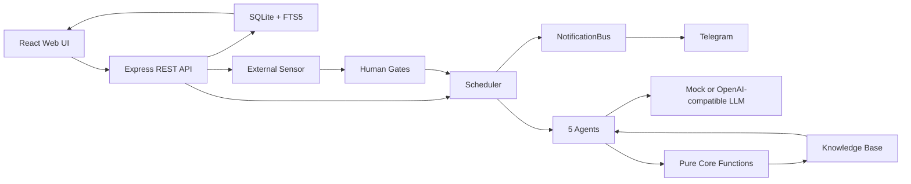

> 迭代前必读：[PRINCIPLES.md](./PRINCIPLES.md)。违反 Part 1 任何一条，等于破坏 Alaya 的产品根基。

# Alaya

Alaya 是一个本地优先的 AI-native「认知复利飞轮」系统。它把每一轮产品或运营动作沉淀为可审计资产：预测、观察、误差归因、知识、人工闸门和下一轮决策。每一轮都可回放、可核验，下一轮可以引用上一轮的知识——这就是「认知复利」。

默认运行使用 deterministic mock LLM，不调用外部模型；只有显式配置 OpenAI-compatible provider 和 capability 后才会走真实 LLM。

**项目当前态**：稳定配置下的 24h 影子基线已 PASS 并冻结；`MINIMAX_THINKING=adaptive` treatment 臂未通过 provider/schema 稳定性门，不能据此声明认知增强有效。认知质量度量（confidence calibration / ECE）已可信化，并进入发布级实验阶段。详见 [认知质量验证](#认知质量验证-cognition-quality)。

---

## 快速开始

要求：Node.js 20 LTS 和 npm 10。仓库使用 npm workspaces，依赖只从根目录安装。

```bash
npm ci
npm run dev
```

默认地址 `http://localhost:5000`（端口被占用时用 `PORT=5001 npm run dev`）。首次启动会在 `alaya-app/` 下创建本地 SQLite 数据库并写入演示项目。重置本地演示数据：停止服务后删除 `alaya-app/data.db*`，再重新启动。

更多脚本和运行模式见 [docs/configuration.md](./docs/configuration.md)；贡献流程见 [CONTRIBUTING.md](./CONTRIBUTING.md)。

---

## 当前状态

| 部分 | 状态 | 说明 |
| --- | --- | --- |
| Core | 可运行 | TypeScript 纯内核，验证 4 轮认知复利飞轮 |
| Web App | 可运行 | Express + React + SQLite 本地 MVP |
| LLM | mock / OpenAI-compatible | 默认 mock，可切 OpenAI / MiniMax 等兼容端点 |
| Scheduler | 可运行 | 自动推进 cycle；第 5 轮起可由自主目标生成器接管 |
| Sensor | 可运行 | GitHub Issues、表单反馈、本地 CSV/JSON 业务信号导入 |
| Human Gates | 可运行 | Direction / Meaning / Risk gate；支持 Web 和 Telegram 审批 |
| Knowledge | 可运行 | SQLite FTS5、任务前知识注入、合并、冲突复核、时间衰减 |
| Ops | 可运行 | health/ready/metrics、action ledger、secret scan、Docker shadow、备份恢复 |
| Validation | 可运行 | health-signal 长测 runner、shadow analyzer、质量评分与趋势报告 |
| **认知质量验证** | **进行中** | 24h 稳定配置基线已冻结；adaptive treatment 失败不构成增强结论；adaptive-vs-disabled 发布级实验已预注册 |

## Experimental learning loop status

PR-L6 已暂停，并作为[可审计的失败实验案例](./docs/validation/PR_L6_LEARNING_LOOP_FAILED_CASE.md)归档。压缩诊断未通过；该工作不具备 production-ready 状态，也未获得 24h formal acceptance。不得据此推导 learning-effectiveness、science、public 或 product-capability 结论。任何恢复都需要新的架构决定和显式授权；`PRECHECK3` 与 `RUN-L7` 均未启动。

---

## 架构概览



运行链路：`React/Vite -> Express API -> SQLite/FTS5 -> Scheduler -> 5 Agents -> LLM Provider`。所有高风险自动化都必须经过预测账簿、知识状态机、审计日志、capability gate 和人工闸门。

---

## 核心模型

每个 cycle 遵循：

```text
预测 -> 行动 -> 观察 -> 误差归因 -> 知识沉淀 -> 下一轮引用
```

五个 Agent 分工：

| Agent | 作用 |
| --- | --- |
| Orchestrator | 选择目标、引用知识、提出预测与动作 |
| Sensor | 收集反馈和外部信号 |
| Builder | 形成任务或变更包 |
| Distiller | 把观察与误差提炼成知识 |
| Librarian | 管理知识状态、晋级、过期、冲突和隔离 |

详细概念、Telegram、API、运行模式、Docker、观测和 secret 说明见 [docs/configuration.md](./docs/configuration.md)。

---

## 项目结构

```text
.
├── alaya-core/       # 纯 TypeScript 内核：飞轮、状态机、LLM provider、单元测试
├── alaya-app/        # Express + React + SQLite 本地 Web MVP
├── scripts/          # 守卫、E2E、validation、本地 secret 和运维脚本
├── analysis/         # 认知质量实验的统计与指标抽取脚本（power analysis、配对检验）
├── docs/             # PRD、架构、配置、验证、运维和归档文档
├── PRINCIPLES.md     # 项目底线：纯函数、人工闸门、审计写路径、LLM 边界等
├── CONTRIBUTING.md   # 本地开发、PR 和验证规范
├── LICENSE           # MIT license
└── README.md         # 当前入口文档
```

两个主要包：

- `alaya-core`：回答「飞轮逻辑是否成立」，不依赖 Web 或数据库。
- `alaya-app`：把 core 接入 SQLite、页面、Scheduler、Human Gates、Sensor 和 API。

---

## 验证与长跑

默认 PR 门禁只跑 mock / 本地检查，不连接真实 LLM，不执行长测。历史长跑、真实 LLM 验证、health-signal clean retest 说明和逐次验证记录见 [docs/validation/validation-history.md](./docs/validation/validation-history.md)。这些本地检查不能替代 24h analyzer、发布级统计实验或公开科学结论。

### Health-signal 质量评分

`scripts/health-signal-36h-validation.mjs` 提供匿名健康场景长测 runner；`scripts/shadow-analyze.mjs` 会在 run dir 下生成 `quality_summary.json` 和报告中的 `Quality Metrics` 区块。质量层只读取本地日志/SQLite，不改变产品 API，也不把 `validation-logs/` 产物纳入 git。

质量指标当前覆盖：

| 指标 | 口径 |
| --- | --- |
| `decisionTsr` | 单场景 pass@1 oracle-state check：最终 active/strong 知识必须收敛到预期决策，且不能残留未 supersede 的错误侧 |
| `resolutionAccuracy` | 只评分确定性复核 pair；报告 scored/unscored 计数、pair 分布和低覆盖状态，避免少量样本造成假 100% |
| `confidenceCalibration` | 用 10 桶 binned ECE 衡量声明置信度与实际正确性的偏差；calibration 用事件 truth 判定，同侧 dedupe/supersede 不计为错（见下） |
| `faithfulness` | 知识陈述与证据的词面一致性；为次指标，不可抵消主指标 |
| `latencyAndEfficiency` | 报告 runner/harness 观测到的 API、scheduler、knowledge retrieval、LLM agent 延迟以及 token/cost 比值；不是生产检索 SLO |
| `rssSlopeMbPerHour` | 用 `monitor_log.csv.appRssMb` 计算 RSS 线性斜率，报告 `<50 MB/h` 阈值 |

真实 provider smoke 建议使用独立 fresh DB 和 run dir：

```bash
ALAYA_SCHEDULER=false \
ALAYA_AUTO_SEED_DEMO=false \
ALAYA_LLM_PROVIDER=openai \
OPENAI_API_KEY_FILE="$HOME/.config/alaya/openai-api-key" \
OPENAI_BASE_URL=https://api.minimax.io/openai \
OPENAI_MODEL=MiniMax-M3 \
PORT=5300 \
ALAYA_DB_PATH="$PWD/validation-logs/health-signal-smoke/health-signal.db" \
npm run validation:health-signal -- \
  --duration-minutes=30 \
  --sample-minutes=1 \
  --max-samples=10 \
  --scenario=cognition-coverage \
  --log-dir="$PWD/validation-logs/health-signal-smoke"

node scripts/shadow-analyze.mjs validation-logs/health-signal-smoke
```

当前关键本地验收口径：

| 命令 | 期望 |
| --- | --- |
| `npm --prefix alaya-app run check` | TypeScript 0 error |
| `npm --prefix alaya-app test` | App tests 全绿 |
| `npm run test:scripts` | Script tests 全绿 |
| `npm run guard` | Principles guard 全部通过 |
| `npm run test:all` | Core、App、Scripts 全套测试通过 |
| `npm run secret:scan` | 无高置信 secret |

---

## 认知质量验证 (Cognition Quality)

Alaya 把「模型的置信度是否可信」当作一等公民来验证。这条线的核心纪律是：**永不只看汇总指标下结论，必须下钻 reliabilityTable / 原始 events 验证样本有效性。** 项目曾两次因此避免错误结论。

### 已冻结的成果

| 项 | 标识 | 状态 |
| --- | --- | --- |
| 可冻结 24h 基线 | tag `baseline/shadow-24h-base-20260616` | 8 门全绿，前提 `MINIMAX_THINKING=disabled` |
| ECE/calibration 度量修复 | commit `c0319d15` | calibration 改用事件 truth 判定，同侧 dedupe/supersede 不计为错；消除 bucket-level artifact |
| 发布级实验预注册 | commit `00a60d75` | adaptive-vs-disabled 配对重复实验，优越性主判据 + TOST 等效回退 |

### ECE 度量为何可信

早期一次结果曾因 bucket-level truth 归因错误，把注入样本系统性误判为全错，使 ECE 虚高到 0.7。修复后（`c0319d15`）：

- `scripts/lib/cognition-coverage-scenario.mjs`：为注入样本写入显式 `calibrationTruth`（`decision_matches_expected`）。
- `scripts/lib/health-signal-quality.mjs`：calibration 优先用事件 truth，同侧 dedupe/supersede 不算错；ECE 保持 10 桶 binned 形式 `Σ (n_bucket/N)·|accuracy - confMean|`。

### 当前结论：诚实的 Null Result

Phase2 度量修复后的单次双臂对照：ECE_disabled = 0.2012，ECE_adaptive = 0.2067（差 0.0055）。这是**单次观测、无 p 值**，处于噪声量级，不足以断言任一方向。结论是诚实的 null result：**无证据支持开启 adaptive 提升认知质量，默认 `disabled` 合理且更简单。** 完整论证、power analysis 与发布级设计见白皮书。

### 发布级实验工具链

`analysis/` 下的脚本支撑配对重复实验：

| 脚本 | 作用 |
| --- | --- |
| `analysis/phase3_pilot_decision.py` | 从 pilot run 估计 run 间标准差 σ_d，反推达 80% 功效所需样本量 N |
| `analysis/phase3_stats.py` | 冻结的统计分析：单侧配对 t（优越性）+ TOST 等效 + 正态性/稳健性检验 + 预注册判定 |
| `analysis/extract_phase3_metrics.py` | 从每个 run 的 `quality_summary.json` 抽取指标到 CSV（含 bucket 级下钻字段） |

发布级 run 必须通过 7 道有效性硬门：scored≥30、coverage≥0.6、correctnessMode 全 truth、providerRatio=1.0、错误门全 0、注入样本所在桶 accuracy 不得系统性≈0、watchdog 绿且 finalDrain complete。

---

## 关键文档

| 文件 | 内容 |
| --- | --- |
| [PRINCIPLES.md](./PRINCIPLES.md) | 项目底线和治理约束 |
| [CONTRIBUTING.md](./CONTRIBUTING.md) | 本地开发、PR、提交和验证规范 |
| [docs/configuration.md](./docs/configuration.md) | 运行模式、配置、API、Telegram、Docker、观测、secret 和功能细节 |
| [docs/PRD.md](./docs/PRD.md) | 原始产品需求文档 |
| [docs/architecture-review.md](./docs/architecture-review.md) | 实现方案、架构评审和 PRD 漏洞分析 |
| [docs/validation/validation-history.md](./docs/validation/validation-history.md) | CI、长程验证和历史验证记录 |
| [docs/validation/VALIDATION_REPORT.md](./docs/validation/VALIDATION_REPORT.md) | 历史验证报告入口 |
| [docs/validation/2026-06-17-alaya-shadow-24h-baseline-freeze.md](./docs/validation/2026-06-17-alaya-shadow-24h-baseline-freeze.md) | 24h 影子基线冻结记录 |
| [docs/validation/WHITEPAPER_cognition_adaptive_null_result.md](./docs/validation/WHITEPAPER_cognition_adaptive_null_result.md) | 认知质量 null-result 白皮书（方法论 + power analysis） |
| [docs/validation/EXPERIMENT_PREREG_phase3_publication.md](./docs/validation/EXPERIMENT_PREREG_phase3_publication.md) | 发布级实验预注册（判据冻结） |
| [docs/validation/RUN_PLAYBOOK_phase3.md](./docs/validation/RUN_PLAYBOOK_phase3.md) | 发布级配对重复 run 执行手册 |
| [docs/ai/CODEX_MISSION.md](./docs/ai/CODEX_MISSION.md) | 历史 AI 工作指令 |

---

## License

MIT. See [LICENSE](./LICENSE).
