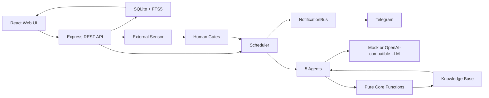

> 迭代前必读：[PRINCIPLES.md](./PRINCIPLES.md)。违反 Part 1 任何一条，等于破坏 Alaya 的产品根基。

# Alaya

Alaya 是一个本地优先的 AI-native「认知复利飞轮」系统。它把每一轮产品或运营动作沉淀为可审计资产：预测、观察、误差归因、知识、人工闸门和下一轮决策。

默认运行使用 deterministic mock LLM，不调用外部模型；只有显式配置 OpenAI-compatible provider 和 capability 后才会走真实 LLM。

## 快速开始

要求：Node.js 20+ 和 npm。

安装依赖并启动本地 Web 应用：

```bash
npm run install:all
npm run dev
```

默认地址：

```text
http://localhost:5000
```

如果 5000 端口被占用：

```bash
PORT=5001 npm run dev
```

首次启动会在 `alaya-app/` 下创建本地 SQLite 数据库并写入演示项目。需要重置本地演示数据时，停止服务后删除 `alaya-app/data.db*`，再重新启动。

## 本地门禁

PR 前至少运行：

```bash
npm --prefix alaya-app run check
npm --prefix alaya-app test
npm run test:scripts
npm run guard
npm run secret:scan
git diff --check
```

生产构建：

```bash
npm run build
```

更多脚本和运行模式见 [docs/configuration.md](./docs/configuration.md)。贡献流程见 [CONTRIBUTING.md](./CONTRIBUTING.md)。

## 当前状态

| 部分 | 状态 | 说明 |
| --- | --- | --- |
| Core | 可运行 | TypeScript 纯内核，验证 4 轮认知复利飞轮 |
| Web App | 可运行 | Express + React + SQLite 本地 MVP |
| LLM | mock / OpenAI-compatible | 默认 mock，可切 OpenAI / MiniMax 等兼容端点 |
| Scheduler | 可运行 | 自动推进 cycle；第 5 轮起可由自主目标生成器接管 |
| Sensor | 可运行 | GitHub Issues、表单反馈、本地 CSV/JSON 业务信号导入 |
| Human Gates | 可运行 | Direction / Meaning / Risk gate；支持 Web 和 Telegram 审批 |
| Knowledge | 可运行 | SQLite FTS5、任务前知识注入、合并、冲突复核、时间衰减 |
| Ops | 可运行 | health/ready/metrics、action ledger、secret scan、Docker shadow、备份恢复 |

## 项目结构

```text
.
├── alaya-core/       # 纯 TypeScript 内核：飞轮、状态机、LLM provider、单元测试
├── alaya-app/        # Express + React + SQLite 本地 Web MVP
├── scripts/          # 守卫、E2E、validation、本地 secret 和运维脚本
├── docs/             # PRD、架构、配置、验证、运维和 AI 工作文档
├── PRINCIPLES.md     # 项目底线：纯函数、人工闸门、审计写路径、LLM 边界等
├── CONTRIBUTING.md   # 本地开发、PR 和验证规范
├── LICENSE           # MIT license
└── README.md         # 当前入口文档
```

两个主要包：

- `alaya-core`：回答「飞轮逻辑是否成立」，不依赖 Web 或数据库。
- `alaya-app`：把 core 接入 SQLite、页面、Scheduler、Human Gates、Sensor 和 API。

## 架构概览



运行链路：`React/Vite -> Express API -> SQLite/FTS5 -> Scheduler -> 5 Agents -> LLM Provider`。所有高风险自动化都必须经过预测账簿、知识状态机、审计日志、capability gate 和人工闸门。

## 核心模型

每个 cycle 遵循：

```text
预测 -> 行动 -> 观察 -> 误差归因 -> 知识沉淀 -> 下一轮引用
```

五个 Agent 分工：

| Agent | 作用 |
| --- | --- |
| Orchestrator | 选择目标、引用知识、提出预测与动作 |
| Sensor | 收集反馈和外部信号 |
| Builder | 形成任务或变更包 |
| Distiller | 把观察与误差提炼成知识 |
| Librarian | 管理知识状态、晋级、过期、冲突和隔离 |

详细概念、Telegram、API、运行模式、Docker、观测和 secret 说明见 [docs/configuration.md](./docs/configuration.md)。

## 验证与长跑

默认 PR 门禁只跑 mock / 本地检查，不连接真实 LLM，不执行长测。历史长跑、真实 LLM 验证、health-signal clean retest 说明和逐次验证记录已迁到 [docs/validation/validation-history.md](./docs/validation/validation-history.md)。

当前关键本地验收口径：

| 命令 | 期望 |
| --- | --- |
| `npm --prefix alaya-app run check` | TypeScript 0 error |
| `npm --prefix alaya-app test` | App tests 全绿，当前基线至少 202 tests |
| `npm run test:scripts` | Script tests 全绿 |
| `npm run guard` | Principles guard 17 项通过 |
| `npm run secret:scan` | 无高置信 secret |

## 关键文档

| 文件 | 内容 |
| --- | --- |
| [PRINCIPLES.md](./PRINCIPLES.md) | 项目底线和治理约束 |
| [CONTRIBUTING.md](./CONTRIBUTING.md) | 本地开发、PR、提交和验证规范 |
| [docs/configuration.md](./docs/configuration.md) | 运行模式、配置、API、Telegram、Docker、观测、secret 和功能细节 |
| [docs/validation/validation-history.md](./docs/validation/validation-history.md) | CI、长程验证和历史验证记录 |
| [docs/PRD.md](./docs/PRD.md) | 原始产品需求文档 |
| [docs/architecture-review.md](./docs/architecture-review.md) | 实现方案、架构评审和 PRD 漏洞分析 |
| [docs/ai/CODEX_MISSION.md](./docs/ai/CODEX_MISSION.md) | 历史 AI 工作指令 |
| [docs/validation/VALIDATION_REPORT.md](./docs/validation/VALIDATION_REPORT.md) | 历史验证报告入口 |
| [docs/ops/00-baseline-audit.md](./docs/ops/00-baseline-audit.md) | hardening 前仓库基线与入口图 |
| [docs/ops/05-shadow-run-7d.md](./docs/ops/05-shadow-run-7d.md) | 7 天 shadow run 操作手册 |

## License

MIT. See [LICENSE](./LICENSE).
