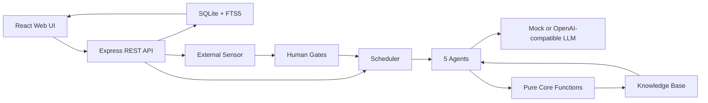

> 迭代前必读：[PRINCIPLES.md](./PRINCIPLES.md)。违反 Part 1 任何一条，等于破坏 Alaya 的产品根基。

# Alaya

Alaya 是一个本地优先的 AI-native「认知复利飞轮」系统。它把每一轮产品或运营动作沉淀为可审计资产：预测、观察、误差归因、知识、人工闸门和下一轮决策。

项目的核心目标不是让 Agent 无限制自动行动，而是让 AI 在可追责、可回滚、可复盘的约束下，持续把经验变成下一轮更好的判断。

## 一句话理解

Alaya = 本地 SQLite 记忆层 + 5 个 Agent 飞轮 + 人工闸门 + 预测账簿 + 知识库 + 可选真实 LLM / GitHub Sensor。

默认模式使用 deterministic mock LLM，不调用外部模型；配置 OpenAI-compatible provider 后可以切到真实 LLM。

## 当前状态

| 部分 | 状态 | 说明 |
| --- | --- | --- |
| Core | 可运行 | TypeScript 纯内核，验证 4 轮认知复利飞轮 |
| Web App | 可运行 | Express + React + SQLite，本地完整 MVP |
| LLM | mock / OpenAI-compatible | 默认 mock，可切 OpenAI / MiniMax 等兼容端点 |
| Scheduler | 可运行 | 自动推进 cycle；第 5 轮起可由自主目标生成器接管，受 blocking gate、预算和反空转风险闸约束 |
| Sensor | 可运行 | 支持 GitHub Issues 与表单反馈 |
| Knowledge | 可运行 | SQLite FTS5 搜索，支持近义合并、`supersededBy` 保留、冲突隔离和详情引用上限保护 |
| Governance | 可运行 | `PRINCIPLES.md` + guard 脚本约束核心底线 |

## 目录

- [快速开始](#快速开始)
- [项目结构](#项目结构)
- [系统架构](#系统架构)
- [核心概念](#核心概念)
- [自主进化与长期验证](#自主进化与长期验证)
- [Web 功能地图](#web-功能地图)
- [常用命令](#常用命令)
- [真实 LLM 与 Secret](#真实-llm-与-secret)
- [本地数据](#本地数据)
- [API 概览](#api-概览)
- [验证记录](#验证记录)
- [路线图](#路线图)
- [文档索引](#文档索引)

## 快速开始

要求：

- Node.js 20+
- npm

安装依赖：

```bash
npm run install:all
```

启动 Web 应用：

```bash
npm run dev
```

默认地址：

```text
http://localhost:5000
```

如果 5000 端口被占用：

```bash
PORT=5001 npm run dev
```

首次启动会在 `alaya-app/` 下创建本地 SQLite 数据库，并 seed 一个「一键发布演示项目」。演示数据包含 4 轮闭环、知识沉淀、预测账簿、人工闸门和 Agent 运行记录。

## 项目结构

```text
.
├── alaya-core/     # 纯 TypeScript 内核：飞轮、状态机、LLM provider、单元测试
├── alaya-app/      # Express + React + SQLite 本地 Web MVP
├── scripts/        # 守卫、E2E、live readiness、本地 secret 工具
├── PRINCIPLES.md   # 项目底线：纯函数、人工闸门、审计写路径、LLM 边界等
├── Alaya_PRD.md    # 原始产品需求文档
└── README.md       # 当前入口文档
```

两个主要包：

- `alaya-core`：回答「飞轮逻辑是否成立」。它不依赖 Web，也不依赖数据库。
- `alaya-app`：把 core 接入数据库、页面、Scheduler、Human Gates、Sensor 和 API。

## 系统架构



运行链路：

```text
React/Vite -> Express API -> SQLite/FTS5 -> Scheduler -> 5 Agents -> LLM Provider
```

所有高风险自动化都必须经过代码约束和人工闸门。LLM 可以给建议，但不能绕过预测账簿、知识状态机、审计日志和 gate budget。

## 核心概念

### 1. Flywheel

每一轮 cycle 都会经历：

```text
预测 -> 行动 -> 观察 -> 误差归因 -> 知识沉淀 -> 下一轮引用
```

第 3 轮必须被前两轮知识真实改变，而不是形式上引用。第 4 轮继续要求产出 rollback-ready change package 和 audit summary。第 5 轮起，如果脚本化场景已经用尽，Scheduler 会生成新的自主目标，而不是复用最后一轮模板或停止在场景耗尽状态。

### 2. Five Agents

| Agent | 作用 |
| --- | --- |
| Orchestrator | 选择本轮目标、引用知识、提出预测与动作 |
| Sensor | 收集反馈和外部信号 |
| Builder | 形成任务或变更包 |
| Distiller | 把观察与误差提炼成知识 |
| Librarian | 管理知识状态、晋级、过期、冲突和隔离 |

### 3. Human Gates

系统内置三类闸门：

- Direction gate：方向是否允许执行
- Meaning gate：信号是否值得进入知识循环
- Risk gate：风险、成本、阻断条件是否需要人工处理

### 4. Prediction Ledger

每个 claim 都要能被观测和计算误差。系统不会把「感觉变好」当作成功证明，而是保存目标、实际值、误差、归因和修正动作。

### 5. Knowledge Base

知识不是普通笔记。每条知识都有置信度、状态、来源、引用记录、有效期和治理字段。过期、冲突或未经验证的知识不能无条件支撑下一轮决策。

Librarian 会对近义知识做熵减合并：保留主条目，给被合并条目写入 `supersededBy`，不做物理删除。检索和高风险证据集默认排除 stale、quarantined、conflict 和 superseded 条目。

## 自主进化与长期验证

Alaya 的默认 4 轮场景仍然作为治理回归基线保留。超过第 4 轮后，系统会基于当前项目身份、世界模型、已验证知识、上轮误差和近期反馈生成下一轮目标。

自主进化有四类停机风险闸：

- `evolution_stalled`：连续误差不改善。
- `goal_repetition`：新目标与历史目标或被拒方向重复。
- `maturation_stall`：决策知识增长但 strong 知识不成熟。
- `knowledge_explosion`：可决策知识规模异常增长。

长程离线验证：

```bash
npm run e2e:long-evolution
```

该脚本会跑 20 轮 mock LLM 飞轮，检查不再出现 `scenario_exhausted`、目标不重复、知识规模有界、合并事件有审计记录、blocking gate 不膨胀。

## Web 功能地图

| 页面 | 作用 |
| --- | --- |
| Dashboard | 当前项目、cycle、风险、预算、最近知识 |
| Human Gates | 批准、修改或否决方向闸、意义闸、风险闸 |
| Prediction Ledger | 查看预测、观察、误差和归因 |
| Knowledge Base | 搜索知识、查看置信度、来源和 Agent 引用 |
| Cycle Review | 复盘单轮 cycle、Agent 输出和复利证据 |
| New Project | Onboarding Interview，创建新项目 |
| Project Setup | 修正 seed identity、world model、redlines 和第一轮 claim |

## 常用命令

从仓库根目录运行：

```bash
npm run test:all       # core + app + scripts 测试
npm run guard          # 治理底线守卫
npm run typecheck      # core + app 类型检查
npm run build          # Web app 生产构建
npm run flywheel            # 4 轮飞轮模拟
npm run e2e:long-evolution  # 20 轮自主进化离线验收
npm run audit:upgrade       # 升级 readiness 审计
```

TypeScript 运行入口统一使用 `node --import tsx`。这避免在受限环境里直接调用 `tsx` CLI 时创建 IPC pipe 失败，同时保留同样的 TS/ESM 加载能力。核心入口包括 app dev/build、core flywheel、真实 LLM E2E 和长程自主进化 E2E。

Web 开发：

```bash
npm run dev
```

UI 卡顿回归测试需要先启动 Web 服务。默认检测 `http://127.0.0.1:5001`。

终端 A：

```bash
PORT=5001 npm run dev
```

终端 B：

```bash
npm run e2e:ui-freeze
```

如需指定地址：

```bash
ALAYA_E2E_BASE_URL=http://127.0.0.1:5000 npm run e2e:ui-freeze
```

完整 live 验收会调用真实 LLM 和 GitHub，需要本机 secret：

```bash
npm run e2e:live
```

## 真实 LLM 与 Secret

默认不调用真实模型。启用 OpenAI-compatible provider：

```bash
ALAYA_LLM_PROVIDER=openai \
OPENAI_API_KEY=... \
OPENAI_BASE_URL=https://api.openai.com/v1 \
OPENAI_MODEL=gpt-4.1-mini \
npm run dev
```

MiniMax 等兼容端点可通过 `OPENAI_BASE_URL` 和 `OPENAI_MODEL` 切换。

为了避免把 key 写入 shell history，可以使用本地 key file：

```bash
npm run setup:secrets
npm run setup:secrets:check
```

该工具只写：

```text
/private/tmp/alaya-minimax-key
/private/tmp/alaya-github-token
```

文件权限为 `0600`，不会打印 secret 值。

真实 LLM preflight：

```bash
OPENAI_API_KEY_FILE=/private/tmp/alaya-minimax-key \
OPENAI_BASE_URL=https://api.minimax.io/openai \
OPENAI_MODEL=MiniMax-M3 \
npm run e2e:llm
```

`ALAYA_E2E_ALLOW_SKIP=true` 只在没有可用 key 时允许跳过真实调用；如果本机存在 key 但 key 无效，E2E 会 fail closed 并显示 provider 返回的错误。

真实 4 轮飞轮：

```bash
OPENAI_API_KEY_FILE=/private/tmp/alaya-minimax-key \
OPENAI_BASE_URL=https://api.minimax.io/openai \
OPENAI_MODEL=MiniMax-M3 \
npm run e2e:llm-flywheel
```

## 本地数据

默认配置：

```text
PORT=5000
HOST=0.0.0.0
REUSE_PORT=false
```

可复制 `alaya-app/.env.example` 后按需修改。

运行后生成：

```text
alaya-app/data.db
alaya-app/data.db-shm
alaya-app/data.db-wal
```

这些文件不会提交到仓库。需要重置演示数据时，停止服务后删除 `alaya-app/data.db*`，再重新启动。

## API 概览

核心 API：

```text
GET  /api/projects
POST /api/projects
PATCH /api/projects/:id
GET  /api/projects/:id/dashboard
GET  /api/projects/:id/cycles
GET  /api/projects/:id/predictions
POST /api/projects/:id/scheduler/tick
POST /api/scheduler/tick

GET  /api/human-gates
POST /api/human-gates/:id/approve
POST /api/human-gates/:id/modify
POST /api/human-gates/:id/reject

GET  /api/knowledge?projectId=...
GET  /api/knowledge/:id
POST /api/knowledge/search
POST /api/knowledge/:id/approve
POST /api/knowledge/:id/quarantine

GET  /api/cycles/:id/review
POST /api/cycles/:id/run-full
GET  /api/llm-calls/summary?projectId=...
```

外部反馈与集成：

```text
GET  /api/projects/:id/integrations
POST /api/projects/:id/integrations/github
POST /api/projects/:id/integrations/github/issues/sync
POST /api/projects/:id/feedback/form
```

实现入口：

- `alaya-app/server/routes.ts`
- `alaya-app/server/storage.ts`
- `alaya-app/server/flywheel.ts`
- `alaya-app/server/scheduler.ts`
- `alaya-app/server/externalFeedback.ts`

## 验证记录

最近本地验证覆盖：

- `npm run test:all`
- `npm run guard`
- `npm run typecheck`
- `npm run build`
- `npm run flywheel`
- `npm run e2e:long-evolution`
- `npm run e2e:ui-freeze`

知识库详情页稳定性修复已经过压力验证：在大量 Agent 引用记录下，`/api/knowledge/:id` 只返回有限引用，前端只渲染有限列表，并通过浏览器 smoke test 检查页面切换、知识搜索、详情点击和主线程长任务。

已知构建提示：

- 当前构建可能出现一个 PostCSS `from` 选项提示，不影响本地构建结果。

## 路线图

- 把 SQLite 启动时 DDL 升级为显式 migration。
- 增强知识冲突检测、过期提醒和复核任务。
- 为 Builder 接入真实 Codex/Codex CLI 变更包 adapter。
- 增加 provider canary、分 Agent latency 报表和更细的 LLM 失败恢复策略。
- 建立真实使用后的运营指标：人工闸门耗时、LLM 单轮成本、预测可测率、知识复用率、blocking gate backlog 和每轮复利增益。

## 文档索引

| 文件 | 内容 |
| --- | --- |
| [PRINCIPLES.md](./PRINCIPLES.md) | 项目底线和治理约束 |
| [Alaya_PRD.md](./Alaya_PRD.md) | 原始产品需求文档 |
| [Alaya_实现方案与架构评审.md](./Alaya_实现方案与架构评审.md) | 实现方案、架构评审和 PRD 漏洞分析 |
| [alaya-core/README.md](./alaya-core/README.md) | Core 内核说明 |
| [alaya-app/BUILD_SPEC.md](./alaya-app/BUILD_SPEC.md) | Web MVP 构建规格 |
| [alaya-app/BUILD_REPORT.md](./alaya-app/BUILD_REPORT.md) | 构建与验证报告 |

## License

MIT
