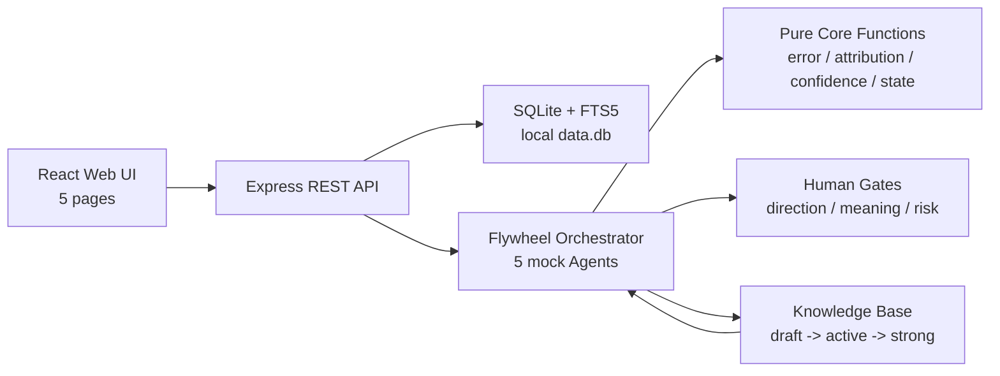

# Alaya — 认知复利飞轮系统

Alaya 是一个本地优先的「认知复利」MVP：每一轮产品/运营动作都会留下预测、观察、误差归因和知识沉淀；下一轮决策必须显式引用这些知识，并被人工闸门约束在安全边界内。

当前仓库实现的是 **Phase 1**：

- `alaya-core`: TypeScript 纯内核，验证飞轮机制是否成立。
- `alaya-app`: Express + React + SQLite Web MVP，把内核接上数据库和 5 个页面。
- LLM 当前为 deterministic mock，不调用外部 OpenAI/Anthropic API。
- SQLite 数据库本地生成，`data.db*` 不提交到仓库。

## 项目状态

| 模块 | 状态 | 说明 |
| --- | --- | --- |
| `alaya-core` | 可运行 | 34 个单元测试覆盖误差计算、归因、置信度和知识状态机 |
| `alaya-app` | 可运行 | Dashboard、Human Gates、Prediction Ledger、Knowledge Base、Cycle Review |
| 数据库 | 本地 SQLite | 首次启动自动 seed 一键发布演示项目 |
| 搜索 | FTS5 | 知识库支持中文全文检索 |
| LLM | mock | 通过 `LLMProvider` 预留真实 LLM 接口 |

## 目录

- [快速开始](#快速开始)
- [系统架构](#系统架构)
- [核心飞轮](#核心飞轮)
- [Web MVP](#web-mvp)
- [API 总览](#api-总览)
- [验证命令](#验证命令)
- [本地数据与配置](#本地数据与配置)
- [接入真实 LLM](#接入真实-llm)
- [路线图](#路线图)
- [文档索引](#文档索引)

## 快速开始

要求：

- Node.js 20+
- npm
- macOS/Linux/Windows 均可，本项目当前主要在 macOS 本地验证

从仓库根目录安装并验证：

```bash
npm run install:all
npm test
npm run flywheel
npm run typecheck
npm run build
```

运行完整 Web 应用：

```bash
npm --prefix alaya-app run dev
```

默认访问：

```text
http://localhost:5000
```

如果 `5000` 被占用：

```bash
PORT=5001 npm --prefix alaya-app run dev
```

首次启动会自动创建本地 SQLite 数据库，并 seed 一个「一键发布演示项目」，包含 3 轮已闭环的飞轮、4 条知识、4 个闸门和 mock LLM 调用日志。

## 系统架构



当前运行链路：

```text
React/Vite 前端 -> Express REST API -> SQLite + FTS5 -> mock flywheel/Agent/LLM
```

项目现在没有调用外部大模型 API。`/api/llm-calls` 记录的是 deterministic mock LLM 调用日志。

## 核心飞轮

`alaya-core` 用最小逻辑验证「飞轮能不能转起来」：

- `compute_error`: 计算预测误差 `E_cycle` 和 `worstClaimError`
- `classify_error`: 将误差归因为 model / data / execution / external
- `update_confidence`: 根据证据更新知识置信度，支持灰区弱累加和时间衰减
- `transition_state`: 推动知识从 draft 到 active / strong / verified，或进入 stale / conflict / quarantined
- `agents`: Orchestrator、Sensor、Builder、Distiller、Librarian 的 mock 调度

3 轮确定性场景：

1. 第 1 轮：假设「用户最关心快速发布」，上线一键发布。activation 只有 `0.12`，归因 model error，提炼 K1「用户对不可预期的自动操作有恐惧」。
2. 第 2 轮：基于 K1 改成 dry-run 预览与确认。activation 到 `0.34`，达标，提炼 K2「可预览/可逆降低高风险动作使用门槛」。
3. 第 3 轮：引用 K1 + K2，不再新增不可预览自动化，而是把预览模式迁移到删除操作。K2 晋级 strong。

这满足 PRD 17.3 的关键验收：第 3 轮决策被前两轮知识真实改变，而不是形式引用。

## Web MVP

`alaya-app` 是完整本地产品形态：

| 页面 | 功能 |
| --- | --- |
| Dashboard | 当前项目、cycle、飞轮阶段、人工预算、最近知识和风险 |
| Human Gates | 方向闸、意义闸、风险闸的批准、修改和否决 |
| Prediction Ledger | 预测、观察、误差、归因、修正动作和准确率趋势 |
| Knowledge Base | 知识列表、FTS5 搜索、置信度、来源、引用和隔离 |
| Cycle Review | 单轮复盘、Agent 运行记录、引用知识和复利证据 |

开发模式：

```bash
cd alaya-app
npm install
npm run dev
```

生产构建：

```bash
cd alaya-app
npm run build
npm run start
```

## API 总览

核心 REST API：

```text
GET  /api/projects
GET  /api/projects/:id/dashboard
GET  /api/projects/:id/cycles
GET  /api/projects/:id/predictions

GET  /api/human-gates
POST /api/human-gates/:id/approve
POST /api/human-gates/:id/modify
POST /api/human-gates/:id/reject

GET  /api/knowledge?projectId=...
GET  /api/knowledge/:id
POST /api/knowledge/search
POST /api/knowledge/:id/approve
POST /api/knowledge/:id/quarantine

GET  /api/cycles/:id/review
POST /api/cycles/:id/run-full
GET  /api/llm-calls/summary?projectId=...
```

实现入口：

- `alaya-app/server/routes.ts`
- `alaya-app/server/flywheel.ts`
- `alaya-app/server/storage.ts`

## 验证命令

从根目录运行：

```bash
npm test
npm run flywheel
npm run typecheck
npm run build
```

当前本地验证快照：

- `npm test`: 34/34 通过
- `npm run flywheel`: PRD 17.3 飞轮验收通过
- `npm run typecheck`: core + app 类型检查通过
- `npm run build`: 生产构建通过

已知构建提示：

- 一个 PostCSS 插件提示未向 `postcss.parse` 传入 `from` 选项；当前不影响本地构建。

## 本地数据与配置

`alaya-app` 默认读取：

```bash
PORT=5000
HOST=0.0.0.0
REUSE_PORT=false
```

可复制 `alaya-app/.env.example` 后按需修改。

本地运行会生成：

```text
alaya-app/data.db
alaya-app/data.db-shm
alaya-app/data.db-wal
```

这些文件已被 `.gitignore` 排除。重置演示数据时，停止后端后删除 `alaya-app/data.db*`，再重新启动即可自动 seed。

## 接入真实 LLM

当前全程使用 mock LLM，优点是确定性、可复现、零成本。真实 LLM 接入点已经预留：

- `alaya-core/src/llm/provider.ts`
- `alaya-app/shared/core/*`
- `alaya-app/server/flywheel.ts`

建议下一步实现一个 provider adapter：

```text
LLMProvider -> OpenAI / Anthropic / local model
```

业务层仍保留同一套飞轮逻辑，规则只做护栏，LLM 负责生成候选目标、解释、知识提炼和复盘草稿。

## 修复的 PRD 漏洞

| 编号 | 问题 | 修复 |
| --- | --- | --- |
| A | `compute_error` 无法处理「越小越好」指标 | 由 operator 推导方向因子 |
| B | 目标值为 0 时除零 | scale 强制正下限 |
| C | `E_cycle` 平方加权稀释大错 | 返回 `worstClaimError` 并支持关键 claim 权重 |
| D | evidence count 定义不一致 | 统一为 `(alpha - 1) + (beta - 1)` |
| E | 灰区知识无法晋级 | 灰区弱累加 + 人类/外部验证通道 |
| F | 知识衰减缺失 | `score * exp(-lambda * cyclesSinceValidated)` |
| G | binary / directional claim 不进误差 | 所有可计算 claim 纳入 |
| H | 字段级写权限无机制 | 写入 `event_log` 记录 actor |

详细推导见 `Alaya_实现方案与架构评审.md`。

## 路线图

- 接入真实 LLM provider，保留 mock 作为测试模式
- 增加真实项目创建/编辑流程，而不是只依赖 seed demo
- 为 Human Gates 增加回滚与审计视图
- 为知识库增加冲突检测、过期提醒和复核任务
- 增加端到端测试与 GitHub Actions
- 把 SQLite schema 迁移管理从启动时 DDL 升级为显式 migration

## 文档索引

| 文件 | 内容 |
| --- | --- |
| `Alaya_PRD.md` | 原始产品需求文档 |
| `Alaya_实现方案与架构评审.md` | 实现方案、架构评审、8 个 PRD 漏洞分析与验算 |
| `alaya-core/README.md` | 内核项目说明 |
| `alaya-app/BUILD_SPEC.md` | 全栈 MVP 构建规格 |
| `alaya-app/BUILD_REPORT.md` | 构建与验证报告 |

## License

MIT
