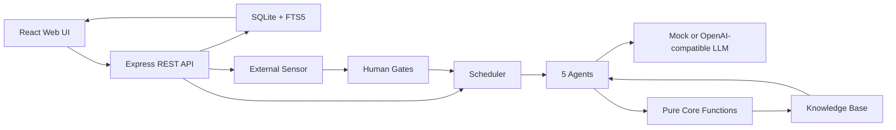

> 迭代前必读：[PRINCIPLES.md](./PRINCIPLES.md)。违反 Part 1 任何一条，等于破坏 Alaya 的产品根基。

# Alaya

Alaya 是一个本地优先的 AI-native「认知复利飞轮」系统。它把每一轮产品或运营动作沉淀为可审计资产：预测、观察、误差归因、知识、人工闸门和下一轮决策。

项目的核心目标不是让 Agent 无限制自动行动，而是让 AI 在可追责、可回滚、可复盘的约束下，持续把经验变成下一轮更好的判断。

## 一句话理解

Alaya = 本地 SQLite 记忆层 + 5 个 Agent 飞轮 + 人工闸门 + 预测账簿 + 知识库 + 可选真实 LLM / GitHub Sensor。

默认模式使用 deterministic mock LLM，不调用外部模型；配置 OpenAI-compatible provider 后可以切到真实 LLM。

## 当前状态

| 部分 | 状态 | 说明 |
| --- | --- | --- |
| Core | 可运行 | TypeScript 纯内核，验证 4 轮认知复利飞轮 |
| Web App | 可运行 | Express + React + SQLite，本地完整 MVP |
| LLM | mock / OpenAI-compatible | 默认 mock，可切 OpenAI / MiniMax 等兼容端点 |
| Scheduler | 可运行 | 自动推进 cycle；第 5 轮起可由自主目标生成器接管，受 blocking gate、预算和反空转风险闸约束 |
| Sensor | 可运行 | 支持 GitHub Issues 与表单反馈 |
| Knowledge | 可运行 | SQLite FTS5 搜索、任务前知识注入、近义合并、`supersededBy` 保留、冲突隔离、时间衰减和详情引用上限保护 |
| Health | 可运行 | `/healthz`、`/readyz`、`/metrics` 提供运行探针；`/health` 页面与 `/api/flywheel/health` API 展示复利、知识成熟和 human gate 压力 |
| Governance | 可运行 | `PRINCIPLES.md`、guard 脚本、CI、secret scan、capability gate 和验证脚本约束核心底线 |
| Long-run Hardening | 可运行 | 显式运行模式、env fail-fast、脱敏、action ledger、health/ready/metrics、Docker shadow compose 和备份/恢复脚本 |

## 目录

- [快速开始](#快速开始)
- [项目结构](#项目结构)
- [系统架构](#系统架构)
- [核心概念](#核心概念)
- [自主进化与长期验证](#自主进化与长期验证)
- [Web 功能地图](#web-功能地图)
- [常用命令](#常用命令)
- [运行模式与安全模型](#运行模式与安全模型)
- [数据库迁移、备份与恢复](#数据库迁移备份与恢复)
- [Docker Shadow 部署与 smoke 验证](#docker-shadow-部署与-smoke-验证)
- [可观测性与审计账本](#可观测性与审计账本)
- [真实 LLM 与 Secret](#真实-llm-与-secret)
- [CI 与 24h 验证](#ci-与-24h-验证)
- [本地数据](#本地数据)
- [API 概览](#api-概览)
- [验证记录](#验证记录)
- [路线图](#路线图)
- [文档索引](#文档索引)

## 快速开始

要求：

- Node.js 20+
- npm

安装依赖：

```bash
npm run install:all
```

启动 Web 应用：

```bash
npm run dev
```

默认地址：

```text
http://localhost:5000
```

如果 5000 端口被占用：

```bash
PORT=5001 npm run dev
```

首次启动会在 `alaya-app/` 下创建本地 SQLite 数据库，并 seed 一个「一键发布演示项目」。演示数据包含 4 轮闭环、知识沉淀、预测账簿、人工闸门和 Agent 运行记录。

## 项目结构

```text
.
├── alaya-core/     # 纯 TypeScript 内核：飞轮、状态机、LLM provider、单元测试
├── alaya-app/      # Express + React + SQLite 本地 Web MVP
├── scripts/        # 守卫、E2E、live readiness、本地 secret 工具
├── PRINCIPLES.md   # 项目底线：纯函数、人工闸门、审计写路径、LLM 边界等
├── Alaya_PRD.md    # 原始产品需求文档
└── README.md       # 当前入口文档
```

两个主要包：

- `alaya-core`：回答「飞轮逻辑是否成立」。它不依赖 Web，也不依赖数据库。
- `alaya-app`：把 core 接入数据库、页面、Scheduler、Human Gates、Sensor 和 API。

## 系统架构



运行链路：

```text
React/Vite -> Express API -> SQLite/FTS5 -> Scheduler -> 5 Agents -> LLM Provider
```

所有高风险自动化都必须经过代码约束和人工闸门。LLM 可以给建议，但不能绕过预测账簿、知识状态机、审计日志和 gate budget。

## 核心概念

### 1. Flywheel

每一轮 cycle 都会经历：

```text
预测 -> 行动 -> 观察 -> 误差归因 -> 知识沉淀 -> 下一轮引用
```

第 3 轮必须被前两轮知识真实改变，而不是形式上引用。第 4 轮继续要求产出 rollback-ready change package 和 audit summary。第 5 轮起，如果脚本化场景已经用尽，Scheduler 会生成新的自主目标，而不是复用最后一轮模板或停止在场景耗尽状态。

### 2. Five Agents

| Agent | 作用 |
| --- | --- |
| Orchestrator | 选择本轮目标、引用知识、提出预测与动作 |
| Sensor | 收集反馈和外部信号 |
| Builder | 形成任务或变更包 |
| Distiller | 把观察与误差提炼成知识 |
| Librarian | 管理知识状态、晋级、过期、冲突和隔离 |

### 3. Human Gates

系统内置三类闸门：

- Direction gate：方向是否允许执行
- Meaning gate：信号是否值得进入知识循环
- Risk gate：风险、成本、阻断条件是否需要人工处理

### 4. Prediction Ledger

每个 claim 都要能被观测和计算误差。系统不会把「感觉变好」当作成功证明，而是保存目标、实际值、误差、归因和修正动作。

### 5. Knowledge Base

知识不是普通笔记。每条知识都有置信度、状态、来源、引用记录、有效期和治理字段。过期、冲突或未经验证的知识不能无条件支撑下一轮决策。

Librarian 会对近义知识做熵减合并：保留主条目，给被合并条目写入 `supersededBy`，不做物理删除。检索和高风险证据集默认排除 stale、quarantined、conflict 和 superseded 条目。

任务前知识注入由 `alaya-app/server/knowledgeInjection.ts` 负责：系统根据当前任务文本从 FTS5 检索 active/strong 且未被 supersede 的知识，构造有上限的 `[PRIOR KNOWLEDGE]` 上下文并写回 `usageCount`、`lastInjectedAt` 和审计事件。显式 schema migration 会执行 FTS5 `rebuild`，确保旧库已有知识也能被新建索引检索到；shadow/staging/production 的常态启动只校验 schema readiness。

时间衰减由 `applyTimeDecay` 和 Scheduler 共同执行。`lastVerifiedAt` 保留真实验证时间，`lastDecayedAt` 记录最近一次自动衰减时间，避免周期性 tick 对同一历史区间重复衰减。被衰减到阈值以下的知识会降级为 stale，并通过 `time_decay_scheduler` 写入审计日志。

## 自主进化与长期验证

Alaya 的默认 4 轮场景仍然作为治理回归基线保留。超过第 4 轮后，系统会基于当前项目身份、世界模型、已验证知识、上轮误差和近期反馈生成下一轮目标。

自主进化有四类停机风险闸：

- `evolution_stalled`：连续误差不改善。
- `goal_repetition`：新目标与历史目标或被拒方向重复。
- `maturation_stall`：决策知识增长但 strong 知识不成熟。
- `knowledge_explosion`：可决策知识规模异常增长。

长程离线验证：

```bash
npm run e2e:long-evolution
```

该脚本会跑 20 轮 mock LLM 飞轮，检查不再出现 `scenario_exhausted`、目标不重复、知识规模有界、合并事件有审计记录、blocking gate 不膨胀。

## Web 功能地图

| 页面 | 作用 |
| --- | --- |
| Dashboard | 当前项目、cycle、风险、预算、最近知识 |
| Human Gates | 批准、修改或否决方向闸、意义闸、风险闸 |
| Prediction Ledger | 查看预测、观察、误差和归因 |
| Knowledge Base | 搜索知识、查看置信度、来源和 Agent 引用 |
| Cycle Review | 复盘单轮 cycle、Agent 输出和复利证据 |
| Flywheel Health | 查看每轮新增知识、晋级、纠错、知识注入、知识状态和复利证明 |
| New Project | Onboarding Interview，创建新项目 |
| Project Setup | 修正 seed identity、world model、redlines 和第一轮 claim |

## P0/P1 证据化内核

本轮 P0/P1 在本地 SQLite 架构上增加可追踪、可评测、可审计的证据层，不依赖外部 OTel 或 LangSmith 服务。

- `trace_events` 记录 OTel-compatible 的 cycle state、agent run、LLM call、knowledge injection、error classification、principle transition、approval 和 action risk 事件；`event_log` 保留为原有审计流。
- `action_ledger` 记录高风险动作的 risk level、approval gate、rollback plan、audit summary 和 idempotency key。只有 `approved` direction gate，或与该动作 idempotency key 匹配的 `approved` risk gate，才能放行需要审批的动作；`pending`、`modified`、`rejected` 都不会被视为批准。
- `RiskLevel` 分为 `read_only`、`draft_only`、`local_write`、`external_write`、`destructive`、`financial`、`compliance_sensitive`。内部 local write 默认可免审批；external/destructive/financial/compliance-sensitive 必须经过 gate。
- Model router 默认沿用 `ALAYA_LLM_PROVIDER` / `OPENAI_MODEL`，也支持 `ALAYA_MODEL_ROUTING_JSON` 和 role-specific env override；`llm_calls` 会记录 provider/model/route reason。
- `npm run benchmark:smoke` 使用 deterministic mock cases 覆盖 round4、knowledge injection、rollback package、source reliability、principle decay、prompt injection、action risk、model routing 和 trace completeness。

## 常用命令

从仓库根目录运行：

```bash
npm run test:all       # core + app + scripts 测试
npm run guard          # 治理底线守卫
npm run typecheck      # core + app 类型检查
npm run build          # Web app 生产构建
npm run flywheel            # 4 轮飞轮模拟
npm run e2e:long-evolution  # 20 轮自主进化离线验收
npm run benchmark:smoke      # P0/P1 deterministic benchmark
npm run trace:export -- --cycle <cycleId>  # 导出 cycle trace JSONL
npm run audit:upgrade       # 升级 readiness 审计
npm run validation:summary  # 汇总 validation-logs 下最新 SUMMARY.csv
npm run secret:scan         # 高置信 secret 扫描
npm run ops:pre-upgrade     # 升级前状态检查
npm run ops:backup          # SQLite state 备份
npm run ops:migrate         # 显式 schema migration
npm run ops:restore -- --backup tmp/alaya-backups/<backup>  # 默认 dry-run 恢复
npm run ops:post-upgrade    # 升级后 guard/core/probe 验证
npm run shadow:report -- --out tmp/shadow-report.md
```

TypeScript 运行入口统一使用 `node --import tsx`。这避免在受限环境里直接调用 `tsx` CLI 时创建 IPC pipe 失败，同时保留同样的 TS/ESM 加载能力。核心入口包括 app dev/build、core flywheel、真实 LLM E2E 和长程自主进化 E2E。

## 运行模式与安全模型

Alaya 现在有明确的运行模式。模式由 `ALAYA_MODE` 控制；如果未设置，`NODE_ENV=test` 映射到 `test`，`NODE_ENV=production` 映射到 `production`，其他情况默认为 `development`。

| 模式 | 典型用途 | 默认安全策略 |
| --- | --- | --- |
| `development` | 本地开发、快速调试 | 允许本地写和 mock LLM；外部真实写仍需显式路径 |
| `test` | 单元测试、集成测试 | 不需要真实外部 secret；测试 fixture 可以使用安全假值 |
| `shadow` | 影子运行、只观察不真实写 | 非只读 API 默认 dry-run；写入意图进入 `action_ledger` |
| `staging` | 受控预发 | 高风险能力默认 deny，需要显式 capability flag |
| `production` | 生产长期运行 | env fail-fast；demo seed 禁用；高风险能力最小权限 |

### API 鉴权与内置 UI

`/api/*` 在 `shadow`、`staging`、`production` 中默认需要 API key。服务端接受两种等价形式：

```bash
Authorization: Bearer $ALAYA_API_KEY
X-Alaya-API-Key: $ALAYA_API_KEY
```

`development` 和 `test` 只有在设置了 `ALAYA_API_KEY` 或 `ALAYA_REQUIRE_API_AUTH=true` 时才强制鉴权。`/healthz` 与 `/readyz` 不需要 API key；`/metrics` 使用 loopback/CIDR allowlist 单独保护。

内置 React UI 不会把 API key 打进 bundle，也不会从服务端公开读取 key。生产或 shadow 静态 UI 打开后，在左侧 Project 区域的 `API Key` 输入框填入 key 并保存；前端会把 key 保存在当前浏览器 tab 的 `sessionStorage`，并自动为 React Query、`apiRequest()` 和手写 API fetch 加上 `Authorization: Bearer ...`。关闭 tab 后需要重新输入。点击“清除”会移除本 tab 的 key 并刷新查询。

命令行检查：

```bash
curl -fsS http://127.0.0.1:5000/healthz
curl -fsS -H "Authorization: Bearer $ALAYA_API_KEY" http://127.0.0.1:5000/api/projects
```

`shadow`、`staging`、`production` 缺少 `ALAYA_API_KEY` 会在 env validation 阶段 fail fast。这样不会出现 `/readyz` 看起来正常、但所有 `/api/*` 请求返回 `503 api authentication is not configured` 的半可用状态。

Capability gate 覆盖高风险动作。所有 flag 都通过环境变量开启，默认不要在长期运行里打开。

| Capability | Env | 默认 long-run 行为 | 当前接入点 |
| --- | --- | --- | --- |
| filesystem write | `ALAYA_CAP_FILESYSTEM_WRITE` | deny | 预留给本地写 adapter；shadow API 兜底 dry-run |
| shell execution | `ALAYA_CAP_SHELL_EXECUTION` | deny | 当前业务未接 shell adapter；若新增必须先 gate |
| GitHub write | `ALAYA_CAP_GITHUB_WRITE` | deny | 当前 GitHub 路径只读 issue sensor；写 adapter 必须先 gate |
| database migration | `ALAYA_CAP_DATABASE_MIGRATION` | deny | 只用于显式 `ops:migrate` / `dist/migrate.cjs` |
| unknown network | `ALAYA_CAP_NETWORK_UNKNOWN` | deny | LLM/OpenAI-compatible fetch 与 GitHub fetch 之前检查 |
| LLM call | `ALAYA_CAP_LLM_CALL` | deny in production unless enabled | `callLlm()` 的真实 provider 路径 |
| knowledge write | `ALAYA_CAP_KNOWLEDGE_WRITE` | shadow dry-run, staging/prod deny | 非只读 API、知识/项目/cycle/反馈写路径 |
| scheduler loop | `ALAYA_CAP_SCHEDULER_LOOP` | deny | `startCycleScheduler()` 启动前检查 |
| external notification | `ALAYA_CAP_EXTERNAL_NOTIFICATION` | deny | 当前未接真实通知 adapter；若新增必须先 gate |

Shadow 模式下，`POST /api/knowledge` 这类 mutating API 会返回：

```json
{
  "status": "dry_run",
  "mode": "shadow",
  "capability": "knowledge_write",
  "target": "POST /knowledge"
}
```

同时 `action_ledger` 会写入 `capability.knowledge_write`，`status=dry_run`，包含 actor、mode、capability、target、input hash、结果和时间戳。handler 不会执行真实写入。

生产模式下，相同的默认行为是 `403`，除非显式设置对应 capability。这个设计避免“只在测试里测 gate，但真实路由没接入”的假通过。

高成本端点限速：

```text
ALAYA_COST_RATE_LIMIT_WINDOW_MS=60000
ALAYA_COST_RATE_LIMIT_MAX=10
```

如果这两个变量被误写成非数字，运行时会回退到默认值而不是关闭 limiter。`POST /api/cycles/:id/run-full` 和 `POST /api/scheduler/tick` 都走这个保护；`/healthz`、`/readyz`、`/metrics` 不受高成本限速影响。

## 数据库迁移、备份与恢复

开发和测试模式可以在启动时自动创建/补齐 SQLite schema。`shadow`、`staging`、`production` 的稳态启动不会静默执行 DDL；如果 schema 缺表或缺关键列，启动会 fail fast，提示运行显式迁移。

本地迁移流程：

```bash
npm run ops:pre-upgrade
npm run ops:backup
ALAYA_CAP_DATABASE_MIGRATION=true npm run ops:migrate
npm run ops:post-upgrade
```

`ops:migrate` 会运行 `alaya-app/server/migrate.ts`。生产构建后对应入口是 `dist/migrate.cjs`，Docker shadow 初始化使用这个入口。

备份：

```bash
npm run ops:backup
```

默认输出到：

```text
tmp/alaya-backups/backup-<timestamp>/
```

备份内容包括 SQLite DB 和 WAL/SHM sidecar。脚本会写 `manifest.json`，只记录出现过的 env 变量名，不记录 env 值；`.env` 和 secret 文件不会被备份。

恢复默认是 dry-run：

```bash
npm run ops:restore -- --backup tmp/alaya-backups/<backup-dir>
```

确认恢复前必须停止服务，然后显式加 `--confirm`：

```bash
npm run ops:restore -- --backup tmp/alaya-backups/<backup-dir> --confirm
```

SQLite 备份一致性在服务停止或 WAL checkpoint 后最强。生产/长期 shadow 运行前应先停服务或确认没有活跃写入，再做关键备份。

## Docker Shadow 部署与 smoke 验证

本节是短 smoke，不是 7 天 shadow run。7 天 shadow run 文档在 [docs/ops/05-shadow-run-7d.md](./docs/ops/05-shadow-run-7d.md)，本次不自动执行。

构建镜像：

```bash
docker build -t alaya:local .
docker tag alaya:local alaya:shadow
```

渲染 compose：

```bash
docker compose -f deploy/docker-compose.shadow.yml config
```

第一次使用新的 shadow volume，或升级后需要 schema 变更时，先运行一次显式迁移：

```bash
ALAYA_SHADOW_PORT=5055 docker compose -f deploy/docker-compose.shadow.yml run --rm \
  -e ALAYA_CAP_DATABASE_MIGRATION=true \
  alaya node dist/migrate.cjs
```

正常启动保持 `ALAYA_CAP_DATABASE_MIGRATION=false`：

```bash
ALAYA_SHADOW_PORT=5055 docker compose -f deploy/docker-compose.shadow.yml up -d --no-build
curl -fsS http://localhost:5055/healthz
curl -fsS http://localhost:5055/readyz
curl -fsS http://localhost:5055/metrics
```

证明 shadow 写操作不会真实执行：

```bash
curl -fsS -X POST http://localhost:5055/api/knowledge \
  -H 'Content-Type: application/json' \
  --data '{"id":"kb_shadow_probe","projectId":"proj_shadow","title":"probe","content":"dry run only"}'

curl -fsS 'http://localhost:5055/api/action-ledger?limit=5'
```

预期：第一个请求返回 `202 dry_run`；第二个请求能看到 `capability.knowledge_write` 且 `status=dry_run`。

停止：

```bash
ALAYA_SHADOW_PORT=5055 docker compose -f deploy/docker-compose.shadow.yml down
```

容器安全属性：

- Dockerfile 使用 `node:20-bookworm-slim`，没有 `latest`。
- build/runtime 分阶段，runtime 运行用户是 `alaya`，不是 root。
- `.dockerignore` 排除 `.env`、数据库、日志、缓存、tmp、coverage、node_modules 和 `.git`。
- compose 使用 read-only root filesystem。
- 可写位置限制在 named volumes：`/var/lib/alaya`、`/var/log/alaya`、`/var/cache/alaya`。
- shadow compose 不挂载宿主根目录，不使用 privileged。

## 可观测性与审计账本

运行端点：

```text
GET /healthz   # 进程活着，尽量不因依赖失败而 500
GET /readyz    # 配置、数据库、关键目录可写性、schema readiness
GET /metrics   # Prometheus text
```

`/metrics` 包含：

```text
alaya_uptime_seconds
alaya_mode_info
alaya_scheduler_cycles_total
alaya_scheduler_cycle_duration_ms
alaya_actions_total
alaya_actions_denied_total
alaya_capability_denials_total
alaya_llm_requests_total
alaya_llm_tokens_input_total
alaya_llm_tokens_output_total
alaya_llm_estimated_cost_usd_total
alaya_external_feedback_items_total
alaya_knowledge_injections_total
alaya_stall_events_total
alaya_errors_total
alaya_last_successful_cycle_timestamp
```

LLM 调用现在同时保存：

- `input_token_count`
- `output_token_count`
- `token_count`
- `estimated_cost`

前端 Ledger 和 `/api/llm-calls/summary` 都会展示 input/output split，不再只能看 aggregate token。

审计持久化：

- `event_log`：storage 写路径的 before/after diagnostics，写入前脱敏。
- `trace_events`：cycle、agent、LLM、知识注入、风险动作等 OTel-compatible trace，attributes 写入前脱敏。
- `action_ledger`：高风险动作和 capability decision，包含 status、risk、approval gate、rollback plan、payload 和 idempotency key，payload/audit/rollback 写入前脱敏。

脱敏覆盖 bearer token、Cookie/Set-Cookie、GitHub/OpenAI/Slack token、AWS key id、数据库 URL 密码、private key block、email、明显 phone number，以及对象中 `apiKey/token/secret/password/database_url` 等 secret-like key。Phone redaction 需要至少 10 位数字并带有 `+` 或多个分隔符，因此普通日期如 `2026-06-06`、分组编号如 `1234-5678` 会保留上下文，不会被误替换为 `[redacted-phone]`。

Web 开发：

```bash
npm run dev
```

UI 卡顿回归测试需要先启动 Web 服务。默认检测 `http://127.0.0.1:5001`。

终端 A：

```bash
PORT=5001 npm run dev
```

终端 B：

```bash
npm run e2e:ui-freeze
```

如需指定地址：

```bash
ALAYA_E2E_BASE_URL=http://127.0.0.1:5000 npm run e2e:ui-freeze
```

完整 live 验收会调用真实 LLM 和 GitHub，需要本机 secret：

```bash
npm run e2e:live
```

`alaya-app` 内也提供同名代理入口，供 CI 和脚本在 app 工作目录中调用：

```bash
npm --prefix alaya-app run flywheel:live
```

## 真实 LLM 与 Secret

默认不调用真实模型。启用 OpenAI-compatible provider：

```bash
ALAYA_LLM_PROVIDER=openai \
OPENAI_API_KEY=... \
OPENAI_BASE_URL=https://api.openai.com/v1 \
OPENAI_MODEL=gpt-4.1-mini \
npm run dev
```

MiniMax 等兼容端点可通过 `OPENAI_BASE_URL` 和 `OPENAI_MODEL` 切换。

为了避免把 key 写入 shell history，可以使用本地 key file：

```bash
npm run setup:secrets
npm run setup:secrets:check
```

该工具默认只写用户配置目录，也可用 `OPENAI_API_KEY_FILE` / `GITHUB_TOKEN_FILE`
显式指定其他本地路径：

```text
$HOME/.config/alaya/openai-api-key
$HOME/.config/alaya/github-token
```

文件权限为 `0600`，不会打印 secret 值。

GitHub Actions 中请添加 `LLM_API_KEY` 和 `GH_PAT` 两个 Secrets。不要自定义名为
`GITHUB_TOKEN` 的 Secret；这是 GitHub Actions 的保留令牌名。

真实 LLM preflight：

```bash
OPENAI_API_KEY_FILE=$HOME/.config/alaya/openai-api-key \
OPENAI_BASE_URL=https://api.minimax.io/openai \
OPENAI_MODEL=MiniMax-M3 \
npm run e2e:llm
```

`ALAYA_E2E_ALLOW_SKIP=true` 只在没有可用 key 时允许跳过真实调用；如果本机存在 key 但 key 无效，E2E 会 fail closed 并显示 provider 返回的错误。

真实 4 轮飞轮：

```bash
OPENAI_API_KEY_FILE=$HOME/.config/alaya/openai-api-key \
OPENAI_BASE_URL=https://api.minimax.io/openai \
OPENAI_MODEL=MiniMax-M3 \
npm run e2e:llm-flywheel
```

## CI 与本地长程验证

GitHub Actions 工作流位于 `.github/workflows/ci.yml` 和 `.github/workflows/deploy-readiness.yml`：

- `unit-and-integration`：安装 root/app/core 依赖，运行 guard、app focused regression、app full test、app typecheck、core test、core typecheck、script tests 和 core flywheel simulation。
- `live-llm-validation`：只在 `main` 分支 push 后尝试运行真实 LLM/GitHub live validation；缺少 secret 时明确跳过。
- `deploy-readiness`：默认不需要真实 secret，运行 secret scan、env/redaction/capability/health focused tests、pre-upgrade check、Docker build、shadow compose config 和 principles guard。

Actions secrets：

| Secret | 用途 |
| --- | --- |
| `LLM_API_KEY` | OpenAI-compatible provider key，可指向 MiniMax |
| `GH_PAT` | GitHub live sensor / issue E2E token |
| `OPENAI_BASE_URL` | 可选，默认 `https://api.minimax.io/openai` |
| `OPENAI_MODEL` | 可选，默认 `MiniMax-M3` |

24h fail-closed 本地验证脚本：

```bash
./scripts/24h_validation.sh
```

常用参数：

```bash
ALAYA_VALIDATION_DURATION_SECONDS=86400 \
ALAYA_VALIDATION_SLEEP_SECONDS=600 \
ALAYA_HEALTH_URL=http://127.0.0.1:5000/api/flywheel/health?projectId=... \
./scripts/24h_validation.sh
```

24h 脚本每轮运行 principles guard 和 mock flywheel simulation，每 3 轮尝试 live validation。缺少 secret 时标记 `SKIP`，有 secret 但 API 网络不可达时标记 `SKIP_NET`。如果 guard、simulation 或 live 步骤出现 `FAIL`，最终退出码为非零；连续 3 次 live failure 会提前停止。

12h 长程观测脚本：

```bash
./scripts/12h_validation.sh
```

常用参数：

```bash
ALAYA_VALIDATION_DURATION_SECONDS=43200 \
ALAYA_VALIDATION_SLEEP_SECONDS=600 \
ALAYA_VALIDATION_MAX_ROUNDS=72 \
./scripts/12h_validation.sh
```

12h 脚本用于长时间稳定性观察：principles guard 失败仍然立即停止；simulation、live、live connectivity `SKIP_NET` 和 flywheel health 属于非关键检查，同一检查项连续 3 次失败会写入 `alerts.log`，但不会中断 runner。连续计数按检查项独立维护，避免 health failure 被 unrelated live/sim success 清零。

汇总最近一次验证：

```bash
npm run validation:summary
```

或指定路径：

```bash
npm run validation:summary -- validation-logs/<run>/SUMMARY.csv
```

## 本地数据

默认配置：

```text
PORT=5000
HOST=0.0.0.0
REUSE_PORT=false
```

可复制 `alaya-app/.env.example` 后按需修改。

运行后生成：

```text
alaya-app/data.db
alaya-app/data.db-shm
alaya-app/data.db-wal
```

这些文件不会提交到仓库。需要重置演示数据时，停止服务后删除 `alaya-app/data.db*`，再重新启动。

## API 概览

核心 API：

```text
GET  /api/projects
POST /api/projects
PATCH /api/projects/:id
GET  /api/projects/:id/dashboard
GET  /api/flywheel/health?projectId=...
GET  /api/projects/:id/cycles
GET  /api/projects/:id/predictions
POST /api/projects/:id/scheduler/tick
POST /api/scheduler/tick

GET  /api/human-gates
POST /api/human-gates/:id/approve
POST /api/human-gates/:id/modify
POST /api/human-gates/:id/reject

GET  /api/knowledge?projectId=...
GET  /api/knowledge/:id
POST /api/knowledge/search
POST /api/knowledge/:id/approve
POST /api/knowledge/:id/quarantine

GET  /api/cycles/:id/review
GET  /api/cycles/:id/traces
GET  /api/projects/:id/traces?limit=...
POST /api/cycles/:id/run-full
GET  /api/llm-calls/summary?projectId=...
```

外部反馈与集成：

```text
GET  /api/projects/:id/integrations
POST /api/projects/:id/integrations/github
POST /api/projects/:id/integrations/github/issues/sync
POST /api/projects/:id/feedback/form
```

实现入口：

- `alaya-app/server/routes.ts`
- `alaya-app/server/storage.ts`
- `alaya-app/server/flywheel.ts`
- `alaya-app/server/scheduler.ts`
- `alaya-app/server/externalFeedback.ts`

## 验证记录

### 2026-06-05/06 12h real LLM validation

本地完成一次完整 12 小时长程验证，真实 LLM 路径接入 MiniMax OpenAI-compatible endpoint，GitHub API 连通性预检通过。

```bash
ALAYA_VALIDATION_DURATION_SECONDS=43200 \
ALAYA_VALIDATION_SLEEP_SECONDS=600 \
ALAYA_VALIDATION_MAX_ROUNDS=72 \
bash scripts/12h_validation.sh
```

结果摘要：

| 项目 | 结果 |
| --- | --- |
| 时间窗口 | 2026-06-05 17:53:53 - 2026-06-06 05:57:32 CST |
| 总时长 | 12h 03m 39s |
| 总轮次 | 69，12 小时时长门限先于 72 轮上限触发 |
| Principles guard | 69/69 PASS |
| Mock flywheel simulation | 69/69 PASS |
| Real LLM flywheel live | 23/23 PASS, rounds 3/6/.../69 |
| Planned live skips | 46 |
| Real LLM calls | 460 |
| Tokens | 280,935 |
| Estimated cost | 0.057997 USD |
| Alerts | 0 |
| Residual runner/process | 0 |
| Summary | `validation-logs/12h_20260605_175353/SUMMARY.csv` |
| Detailed report | `docs/validation/2026-06-06-12h-real-llm-validation.md` |

23 个 live 轮次均返回 `ok: true`，每次包含 `llmCalls.count=20`、`eventLogCount=56`、`decisionLogCount=4`。日志扫描未发现 `fetch failed`、`ETIMEDOUT`、`ECONNRESET`、`ENETUNREACH` 或 TCP 443 timeout 类失败。

认知迭代结论：在 `e2e:llm-flywheel` 验收范围内，4-cycle 多 Agent 飞轮可持续运行；后续 cycle 会引用前序知识改变决策，不重复 rejected direction，预测误差会回流到 distiller/world-model 更新，cycle 4 形成 rollback/audit 导向的新原则。这支持“核心设计符合预期、认知可持续迭代、知识库呈现熵减配平特征”的阶段性结论。

边界说明：本次验证不等同于完整 `npm run e2e:live` / GitHub issue sensor 业务链路通过。Health endpoint 未运行，23 次 health probe 均为空响应，`delta=NA`；本次熵减结论来自 live E2E 行为断言，而不是 health API 的 `compoundingProof.round1vs4KnowledgeDelta` 量化指标。

Post-run 修复：审计发现旧版 12h runner 的非关键失败计数是全局计数，health 连续失败会被 unrelated sim/live success 清零，导致三连 health alert 不触发。当前版本已改为按检查项独立计数，并用 9 轮 forced-failure smoke 验证：`live connectivity` 与 `flywheel health` 都在第 9 轮写入 alert，脚本仍正常完成。

### 2026-06-05 3h real LLM validation

本地使用 12h validation runner 压缩为 3 小时窗口完成一次真实 LLM 验证循环：

```bash
ALAYA_VALIDATION_DURATION_SECONDS=10800 \
ALAYA_VALIDATION_SLEEP_SECONDS=600 \
ALAYA_VALIDATION_MAX_ROUNDS=18 \
bash scripts/12h_validation.sh
```

结果摘要：

| 项目 | 结果 |
| --- | --- |
| 时间窗口 | 2026-06-05 07:45:06 - 10:45:29 CST |
| 总轮次 | 18 |
| Principles guard | 18/18 PASS |
| Mock flywheel simulation | 18/18 PASS |
| Real LLM flywheel live | 6/6 PASS, rounds 3/6/9/12/15/18 |
| Non-critical errors | 0 |
| Alerts | 0 |
| Summary | `validation-logs/12h_20260605_074506/SUMMARY.csv` |

6 个 live 轮次均返回 `ok: true`，每次包含 `llmCalls.count=20`，合计约 73,327 tokens，未出现 `fetch failed`、`ETIMEDOUT` 或 TCP 443 超时类错误。本机连通性检查中 MiniMax endpoint 可达，GitHub API 返回 HTTP 200。

边界说明：本次验证覆盖的是 `npm run e2e:llm-flywheel` 的真实 LLM 路径，并证明当前机器能访问真实模型端点；它不等同于完整 `npm run e2e:live` / GitHub issue sensor 端到端业务链路通过。GitHub 业务链路仍需单独跑完整 live E2E 验收。

最近本地验证覆盖：

- `npm run test:all`
- `npm run guard`
- `npm run typecheck`
- `npm run build`
- `npm run benchmark:smoke`
- `npm run flywheel`
- `npm run e2e:long-evolution`
- `npm run secret:scan`
- `npm run ops:migrate`
- Docker shadow migration + health/ready/metrics smoke
- `npm run e2e:ui-freeze`
- `cd alaya-app && node --import tsx --test tests/schema_migration.test.ts tests/update_confidence.decay.test.ts`
- `node --test scripts/tests/live-readiness.test.mjs`

知识库详情页稳定性修复已经过压力验证：在大量 Agent 引用记录下，`/api/knowledge/:id` 只返回有限引用，前端只渲染有限列表，并通过浏览器 smoke test 检查页面切换、知识搜索、详情点击和主线程长任务。

本次治理增强额外覆盖：

- 旧库已有 `knowledge_items` 在 FTS5 迁移后可被知识注入检索。
- Scheduler tick 会自动执行 stale knowledge 时间衰减，并通过 `lastDecayedAt` 避免重复衰减同一时间区间。
- `/health` 页面按当前项目查询 flywheel health 和 pending gates。
- 24h 验证脚本在任何 FAIL 后以非零退出码结束。

已知构建提示：

- 当前构建可能出现一个 PostCSS `from` 选项提示，不影响本地构建结果。

## 路线图

- 增强知识冲突检测、过期提醒和复核任务。
- 为 Builder 接入真实 Codex/Codex CLI 变更包 adapter。
- 增加 provider canary、分 Agent latency 报表和更细的 LLM 失败恢复策略。
- 建立真实使用后的运营指标：人工闸门耗时、LLM 单轮成本、预测可测率、知识复用率、blocking gate backlog 和每轮复利增益。

## 文档索引

| 文件 | 内容 |
| --- | --- |
| [PRINCIPLES.md](./PRINCIPLES.md) | 项目底线和治理约束 |
| [Alaya_PRD.md](./Alaya_PRD.md) | 原始产品需求文档 |
| [Alaya_实现方案与架构评审.md](./Alaya_实现方案与架构评审.md) | 实现方案、架构评审和 PRD 漏洞分析 |
| [alaya-core/README.md](./alaya-core/README.md) | Core 内核说明 |
| [alaya-app/BUILD_SPEC.md](./alaya-app/BUILD_SPEC.md) | Web MVP 构建规格 |
| [alaya-app/BUILD_REPORT.md](./alaya-app/BUILD_REPORT.md) | 构建与验证报告 |
| [docs/ops/00-baseline-audit.md](./docs/ops/00-baseline-audit.md) | hardening 前仓库基线与入口图 |
| [docs/ops/01-secrets-and-env.md](./docs/ops/01-secrets-and-env.md) | env、secret、capability 和脱敏说明 |
| [docs/ops/02-deployment.md](./docs/ops/02-deployment.md) | Docker/systemd 部署与升级流程 |
| [docs/ops/03-state-backup-rollback.md](./docs/ops/03-state-backup-rollback.md) | 状态盘点、备份、恢复和迁移策略 |
| [docs/ops/04-validation-matrix.md](./docs/ops/04-validation-matrix.md) | development/test/shadow/staging/production 验证矩阵 |
| [docs/ops/05-shadow-run-7d.md](./docs/ops/05-shadow-run-7d.md) | 7 天 shadow run 操作手册。本次提交不执行该长跑 |
| [docs/ops/98-verification-ledger.md](./docs/ops/98-verification-ledger.md) | 交叉验证证据台账 |
| [docs/ops/99-long-run-readiness-report.md](./docs/ops/99-long-run-readiness-report.md) | long-run readiness 审计报告 |

## License

MIT
